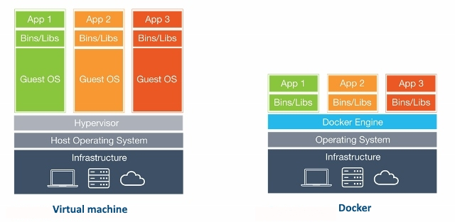

[DevOps Blog](https://medium.com/?tag=devops)
# DevOps Introduction
- Introduction
    
# Linux

- Linux Introduction
- Flavours On Linux
- Linux History
- Linux Advantages
- Compression/Archive
- Scripting
- Fhs/Directory System
- Linux Filters
- Linux Man Pages
- Project

### Table of Contents

---

| No. | Topic                                                                   |
| --- | ----------------------------------------------------------------------- |
| 1   | [**User information**](#user-information)                               |
| 2   | [**File and directory commands**](#file-and-directory-commands)         |
| 3   | [**File permissions**](#file-permissions)                               |
| 4   | [**Networking**](#networking)                                           |
| 5   | [**Installing packages**](#installing-packages)                         |
| 6   | [**Disk usage**](#disk-usage)                                           |
| 7   | [**System and Hardware information**](#system-and-hardware-information) |
| 8   | [**Search Files**](#search-files)                                       |
| 9   | [**SSH**](#ssh)                                                         |
| 10  | [**Vi/Vim-commands**](#vi/vim-commands)                                 |

### User Information

1. **who** It is used to get information about currently logged in user on to system. If you don't provide any option or arguments, the command displays the following information for each logged-in user.

    1. Login name of the user
    2. User terminal
    3. Date & Time of login
    4. Remote host name of the user

   ```bash
   $ who
   sudheer :0 2019-08-04 01:21 (:0)
   ```

2. **whoami:** It display the system’s username

   ```bash
   $ whoami
   sudheer
   ```

3. **id:** It display the user identification(the real and effective user and group IDs) information

   ```bash
   $ id
   uid=1000(sj) gid=1000(sj) groups=1000(sj),4(adm),24(cdrom),27(sudo),30(dip),46(plugdev),120(lpadmin),131(lxd),132(sambashare)
   ```
4. **groups:** This command is used to display all the groups for which the user belongs to.

   ```bash
   $ group
   sj: sj, adm, cdrom, sudo, dip, plugdev, lpadmin, lxd, sambashare
   ```

5. **finger:**  Used to check the information of any currently logged in users. i.e, It displays users login time, tty (name), idle time, home directory, shell name etc.

   ```bash
   $ finger
   Login     Name       Tty      Idle  Login Time   Office     Office Phone
   sj        sj        *:0             Aug 28 01:27 (:0)
   ```

   This may not be available by default in many linux machines. In this case, you need to install it manually.

   ```bash
   $ sudo apt install finger
   ```
6. **users:** Displays usernames of all users currently logged on the system.

   ```bash
   $ users
   sj
   ```

7. **grep:** It  is a powerful pattern searching tool to find information about a specific user from the system accounts file: /etc/passwd.

    ```bash
    $ grep -i sj /etc/passwd
    sj:x:1000:1000:sj,,,:/home/sj:/bin/bash
    ```

8. **W Command:** It(W) is a command-line utility that displays information about currently logged in users and what each user is doing.

    ```bash
    w [OPTIONS] [USER]

    Example:
    w
     18:45:04 up  2:09,  1 user,  load average: 0.09, 0.07, 0.02
    USER     TTY      FROM             LOGIN@   IDLE   JCPU   PCPU WHAT
    sj       :0       :0               01:27   ?xdm?   1:14   0.01s /usr/lib/gdm3/g
    ```

9. **last or lastb:** Displays a list of last logged in users on the system. You can pass user names to display their login and hostname details.

    ```bash
    last [options] [username...] [tty...]

    Example:

    last
    sj       :0           :0               Fri Aug 28 01:27    gone - no logout
    reboot   system boot  5.4.0-29-generic Fri Aug 28 01:27   still running
    sj       :0           :0               Wed Jul 29 11:46 - crash (29+13:40)
    reboot   system boot  5.4.0-29-generic Wed Jul 29 11:45   still running
    sj       :0           :0               Thu May 14 21:04 - crash (75+14:41)
    reboot   system boot  5.4.0-29-generic Thu May 14 21:03   still running

    wtmp begins Thu May 14 21:03:56 2020
    ```

10. **lastlog:** The `lastlog` command is used to find the details of a recent login of all users or of a given user.

    ```cmd
    $ lastlog

    Username         Port     From             Latest
    root                                       **Never logged in**
    daemon                                     **Never logged in**
    bin                                        **Never logged in**
    sys                                        **Never logged in**
    sync                                       **Never logged in**
    games                                      **Never logged in**
    man                                        **Never logged in**
    lp                                         **Never logged in**
    mail                                       **Never logged in**
    news                                       **Never logged in**
    ```

   **[⬆ Back to Top](#table-of-contents)**

### File and directory commands

1. **pwd** The pwd(Present Working Directory) command is used to print the name of the present/current working directory starting from the root.
   ```bash
   $ pwd
   /home/sj/Desktop/Linux
   ```

2. **ls**: The `ls` command is used to list files or directories. It also accepts some flags or options that changes how files or directories are listed in your terminal.

    ```bash
     Syntax:
     ls [flags] [directory]

     Example:
     $ ls
     bin dev lib libx32 mnt  

     //Listing files & directories with time in a rever order
     $ ls -ltr
     drwxr-xr-x 2 sj sj 4096 May 14  2020 Videos
     drwxr-xr-x 2 sj sj 4096 May 14  2020 Templates
     drwxr-xr-x 2 sj sj 4096 May 14  2020 Public

     //Home directory
     $ ls ~
     Desktop    Downloads  Pictures  Sudheer    test   test.txt
     Documents  Music      Public    Templates  test1  Videos
    ```

    Below are the list of possible options for `ls` command,

    ```cmd
    -a Show all (including hidden)
    -R Recursive list
    -r Reverse order
    -t Sort by last modified
    -S Sort by file size
    -l Long listing format
    -1 One file per line
    -m Comma-­sep­arated output
    -Q Quoted output
    ```

3. **mkdir** The mkdir(make directory) command allows users to create directories or folders.

   ```bash
   $ mkdir ubuntu
   $ ls
   ubuntu
   ```

   The option '-p' is used to create multiple directories or parent directories at once.

   ```bash
   $ mkdir -p dir1/dir2/dir3
   $ cd dir1/dir2/dir3
   ~/Desktop/Linux/dir1/dir2/dir3$
   ```

4. **rmdir**: The rmdir(remove directories) is used to remove _empty_ directories. Can be used to delete multiple empty directories as well. Safer to use compared to `rm -r FolderName`. This command can also be forced to delete non-empty directories.

   1. Remove empty directory:

   ```bash
   rmdir FolderName
   ```

   2. Remove multiple directories:

   ```bash
   rmdir FolderName1 FolderName2 FolderName3
   ```

   3. Remove non-empty directories:

   ```bash
   rmdir FolderName1 --ignore-fail-on-non-empty
   ```

   4. Remove entire directory tree. This command is similar to `rmdir a/b/c a/b a`:

   ```bash
   rmdir -p a/b/c
   ```

5. **rm**: The rm(remove) command is used to remove objects such as files, directories, symbolic links etc from the file system.
   1. Remove file: The rm command is used to remove or delete a file
   ```bash
   rm file_name
   ```
   2. Remove file forcefully: The rm command with -f option is used for removal of file without prompting for confirmation.
   ```bash
   rm -f filename
   ```
   3. Remove directory: The rm command with -r option is used to remove the directory and its contents recursively.
   ```bash
   rm -r myDir
   ```
   4. Remove directory forcefully: The rm command with -rf option is used to forcefully remove directory recursively.
   ```bash
   rm -rf myDir
   ```
6. **touch**: The touch command is is used to create, change and modify timestamps of a file without any content.
   1. **Create a new file:** You can create a single file at a time using touch command. The file created is an empty file.
       ```bash
       touch file_name
       ```
   2. **Create multiple files:** You can create the multiple numbers of files at the same time.
       ```bash
       touch file1_name file2_name file3_name
       ```
   3. **Change access time:** The touch command with `a` option is used to change the access time of a file.
       ```bash
       touch -a file_name
       ```
   4. **Change modification time:** The touch command with `m` option is used to change the modified time.
       ```bash
       touch -m file_name
       ```
   5. **Use timestamp of other file:** The touch command with `r` option is used to get timestamp of another file.
       ```bash
       touch -r file2 file1
       ```

       In the above example, we get the timestamp of file1 for file2.

   6. **Create file with Specific time:** The touch command with 't' option is used to create a file with specified time.
       ```bash
       touch -t 1911010000 file_name
       ```
7. **cat**: The cat command is used to create single or multiple files, view contain of file, concatenate files and redirect output in terminal or files.
     ```bash
     $ cat [OPTION] [FILE]...
     ```
   1. **Create a file:** Used to create a file with specific name, content and press exit using `CTRL + D`
       ```bash
       cat > file_name1.txt
       Hello, How are you?
       ```
   2. **View file contents:** You can view contents of a single or more files by mentioning the filenames.

       ```bash
       cat file_name1 file_name2
       ```
   3. **More & Less options:** If a file having a large number of content that won’t fit in the output terminal then `more` & `less` options can be used to indiate additional content.

       ```bash
       cat file_name1.txt | more
       cat file_name1.txt | less
       ```

**[⬆ Back to Top](#table-of-contents)**

### File permissions
Since Linux is a multi-user operating system, it is necessary to provide security to prevent people from accessing each other’s confidential files.
So Linux divides authorization into 2 levels,

1. **Ownership:**
Each file or directory has assigned with 3 types of owners
i. **User:** Owner of the file who created it.
ii. **Group:** Group of users with the same access permissions to the file or directory.
iii. **Other:** Applies to all other users on the system

2. **Permissions:**
Each file or directory has following permissions for the above 3 types of owners.

    i.   **Read:** Give you the authority to open and read a file and lists its content for a directory.

    ii.  **Write:** Give you the authority to modify the contents of a file and add, remove and rename files stored in the directory.

    iii. **Execute:** Give you the authority to run the program in Unix/Linux.

     The permissions are indicated with below characters,

         r = read permission

         w = write permission

         x = execute permission

         \- = no permission

    The above authorization levels represented in a diagram


There is a need to restrict own file/directory access to others.

**Change access:**
The `chmod` command is used to change the access mode of a file.  This command is used to set permissions (read, write, execute) on a file/directory for the owner, group and the others group.

```cmd
chmod [reference][operator][mode] file...

Example
chmod ugo-rwx test.txt
```

There are 2 ways to use this command,

1. **Absolute mode:**
The file permissions will be represented in a three-digit octal number.

     The possible permissions types represented in a number format as below.

     | Permission Type | Number |  Symbol |
     | ------------- | ----- | ----- |
     | No Permission | 0 | --- |
     | Execute | 1 | --x |
     | Write | 2 | -w- |
     | Execute + Write | 3 | -wx |
     | Read | 4 | r-- |
     | Read + Execute | 5 | r-x |
     | Read + Write | 6 | rw- |
     | Read + Write + Execute | 7 | rwx |


Let's update the permissions in absolute mode with an example as below,

   ```cmd
    chmode 764 test.txt
   ```

2. **Symbolic mode:**
In the symbolic mode, you can modify permissions of a specific owner unlike absolute mode.

    The owners are represented as below,

     | Owner | Description |
     | ----- | ----- |
     | u | user/owner |
     | g | group |
     | o | other |
     | a | all |

    and the list of mathematical symbols to modify the file permissions as follows,

     | Operator | Description |
     | ------------- | ----- |
     | + | Adds permission |
     | - | Removes the permission |
     | = | Assign the permission |

**Changing Ownership and Group:**
It is possible to change the the ownership and group of a file/directory using `chown` command.

```cmd
chown user filename
chown user:group filename

Example:
chown John test.txt
chown John:Admin test.txt
```

**Change group-owner only:**
Sometimes you may need to change group owner only. In this case, chgrp command need to be used

```cmd
chgrp group_name filename

Example:
sudo chgrp Administrator test.txt
```

**[⬆ Back to Top](#table-of-contents)**

### Networking

1.  **Display network information:** `ifconfig` command is used to display all network information(ip address, ports etc)

```cmd
ifconfig -a
```

2.  **Test connection to a remote machine:** Send an echo request to test connection of a remote machine.

    ```cmd
    ping <ip-address> or hostname

    Example:
    ping 10.0.0.11
    ```

3.  **Show IP Address:** Display ip address of a currennt machine

    ```cmd
    hostname -I
    (OR)
    ip addr show
    ```

4.  **Active ports:** Shows active or listening ports

     ```cmd
     netstat -pnltu
     ```

5.  **Find information about domain:** `whois` command is used to find out information about a domain, such as the owner of the domain, the owner’s contact information, and the nameservers used by domain.

    ```cmd
    whois [domain]

    Example:
    whois google.com
    ```

**[⬆ Back to Top](#table-of-contents)**

### Installing packages

1. **Install package:**

```cmd
yum install package_name
```

2. **Package description:**
The info command is used to display brief details about a package.

```cmd
yum info package_name
```

3. **Uninstall package:**
The remove command is used to remove or uninstall package name.
```cmd
yum remove package_name
```
4. **Install package from local file:**

It is also possible to install package from local file named package_name.rpm.

```cmd
rpm -i package_name.rpm
```

5. **Install from source code:**

```cmd
tar zxvf sourcecode.tar.gz
cd sourcecode
./configure
make
make install
```

**[⬆ Back to Top](#table-of-contents)**

### Disk usage

1.  **Synopsis:** `du` command is used to check the information of disk usage of files and directories on a machine

```cmd
du [OPTION]... [FILE]...
```

2.  **Disk usage of a directory:** To find out the disk usage summary of a /home/ directory tree and each of its sub directories

```cmd
du  /home/
```

3.  **Disk usage in human readable format:** To find out the disk usage in human readable format

```cmd
du  -h /home/
```

4.  **Total disk usage of a directory:** To find out the total disk usage

```cmd
du  -sh /home/
```

5.  **Total disk usage of all files and directories:** To find out the total disk usage of files and directories

```cmd
du  -ah /home/
```

6.  **Total disk usage of all files and directories upto certain depth:** print the total for a directory only if it is N or fewer levels below the command

```cmd
du  -ah --max-depth 2 /home/
```

7.  **Total disk usage with excluded files:** To find out the total disk usage of files and directories, but excludes the files that matches given pattern.

```cmd
du -ah --exclude="*.txt" /home/
```

8.  **Help:** This command gives information about `du`

```cmd
du  --help
```

**[⬆ Back to Top](#table-of-contents)**

### System and Hardware information

1.  **Print all information**: `uname` is mainly used to print system information.

```bash
$ uname -a
```

2.  **Print kernel name**:

```bash
$ uname -s
```

3.  **Print kernel release**:

```bash
$ uname -r
```

4.  **Print Architecture**:

```bash
$ uname -m
```

5.  **Print Operating System**:

```bash
$ uname -o
```

**[⬆ Back to Top](#table-of-contents)**

### Search Files

1. **Pattern search:**
The `grep` command is used to search patterns in files.

```cmd
grep pattern files
grep -i // Case sensitive
grep -r // Recursive
grep -v // Inverted search

Example:
grep "^hello" test.txt // Hello John
grep -i "hELLo" text.txt // Hello John
```

2. **Find files and directories:**

The `find` command is used to find or search files and directories by file name, folder name, creation date, modification date, owner and permissions etc and perform subsequent operations on them.

i. **Search file with name:**

```cmd
find ./directory_name -name file_name

Example:
find ./test -name test.txt // ./test/test.txt
```

ii. **Search file with pattern:**

```cmd
find ./directory_name -name file_pattern

Example:
find ./test -name *.txt // ./test/test.txt
```

iii. **Search file with executable action:**

```cmd
find ./directory_name -name file_name -exec command

Example:
find ./test -name test.txt -exec rm -i {} \; // Search file and delete it after confirmation
```

iv. **Search for empty files or directories:**

The find command is used to search all empty folders and files in the entered directory or sub-directories.

```cmd
find ./directory_name -empty

Example:
find ./test -empty
//./test/test1
//./test/test2
//./test/test1.txt
```

v. **Search for files with permissions:**

The find command is used to find all the files in the mentioned directory or sub-directory with the given permissions

```cmd
find ./directory_name -perm permission_code

Example:
find ./test -perm 664
```

vi. **Search text within multiple files:**

```cmd
find ./ -type f -name file_pattern -exec grep some_text  {} \;

Example:
find ./ -type f -name "*.txt" -exec grep 'World'  {} \; // Hello World
```

3. **Whereis to locate binary or source files for a command:**
The whereis command in Linux is used to locate the binary, source, and manual page files for a command. i.e, It is used to It is used to find executables of a program, its man pages and configuration files.

```cmd
whereis command_name

Example:
whereis netstat //netstat:  /bin/netstat /usr/share/man/man8/netstat.8.gz(i.e, executable and location of its man page)
```

4. **Locate to find files:**
The locate command is used to find the files by name. This command is faster compared to find command because it searches database for the filename instead of searching your filesystem.

```cmd
locate [OPTION] PATTERN

Example:
locate "*.txt" -n 10 // 10 file search results ending with .txt extension
```

**[⬆ Back to Top](#table-of-contents)**

### SSH

SSH (Secure Shell) is a network protocol that enables secure remote connections between two systems.

1.  **Connect remote machine using IP address or machine name:** The remote server can be connected with local user name using either host name or IP address

```cmd
ssh <host-name> or <ip-address>

Example:
ssh 192.111.66.100
ssh test.remoteserver.com
```

2.  **Connect remote machine using username:** It is also possible specify a user for an SSH connection.

```cmd
ssh username@hostname_or_ip-address

Example:
ssh john@192.0.0.22
ssh john@test.remoteserver.com
```

3.  **:Connect remote machine using custom port** By default, the SSH server listens for a connection on port 22. But you can also specify the custom port.

```cmd
ssh <host-name> or <ip-address> -p port_number

Example:
ssh test.remoteserver.com -p 3322
```

4.  **Generate SSH keys using keygen:** SSH Keygen is used to generate a key pair which consists of public and private keys to improve the security of SSH connections.

```cmd
ssh-keygen -t rsa
```

5.  **Copying SSH keys to servers:** For SSH authentication, `ssh-copy-id` command will be used to copy public key(id_rsa.pub) to server.

```cmd
ssh-copy-id hostname_or_IP
```

6.  **Copy a File Remotely over SSH:** SCP tool is used to securely copy files over the SSH protocol.

```cmd
scp fileName user@remotehost:destinationPath

Example:
scp test.txt test@10.0.0.64:/home/john/Desktop
```

7.  **Edit SSH Config File** SSH server options customized by editing the settings in `sshd_config` file.

```cmd
sudo vim /etc/ssh/sshd_config
```

8.  **Run commands on a remote server** SSH commands can be executed on remote machine using the local machine.

```cmd
ssh test.remoteserver.com mkdir NewDirectoryName // Creating directory on remote machine
```

9.  **Restart SSH service:** You need to restart the service in Linux after making changes to SSH configuration.

```cmd
sudo ssh service restart
(or)
sudo sshd service restart
```

**[⬆ Back to Top](#table-of-contents)**

### Vi/Vim-commands

Vi editor is the most popular text editor from the early days of Unix. Whereas Vim(Vi IMproved) is an improved version of vi editor to be used in CLI (command line interface) for mainly text editing tasks in many configuration files. Some of the other alternatives are Elvis, Nvi, Nano, Joe, and Vile.
It has two main operation modes,

1.  **Command Mode:** It allows the entry of commands to manipulate text.
2.  **Entry mode(Or Insert mode):** It allows typed characters on the keyboard into the current file.

#### 1. Start with Vi Editor

You can create a new file or open an existing file using `vi filename` command.

```cmd
 vi <filename_NEW> or <filename_EXISTING> // Create a new file or open an existing file

 Example:
 vi first.txt
```

Let's see how do you create file, enter the content and leave the CLI by saving the changes.

1.  Create a new file named `first.txt`
2.  Press `i` to enter the insert mode
3.  Enter the text "Hello World!"
4.  Save the text and exit by pressing `:wq!` command
5.  Check the entered text

#### 2. Cursor movement

    These commands will be used in Command mode.

##### Move cursor

You can use arrow keys(left, right, up and down) to move the cursor on the terminal. But you can also other keys for this behavior.

```cmd
 h        # Move left
 j        # Move down
 k        # Move up
 l        # Move right
```

##### Jump one word

These commands used to jump one word at a time

```cmd
w        # Jump forwards to the start of a word
W        # Jump forwards to the start of a WORD
e        # Jump forwards to the start of a word
E        # Jump forwards to the start of a WORD
b        # Jump backwords to the start of a word
B        # Jump backwords to the start of a WORD
```

##### Jump to start or end of a line or next line

These commands used to jump starting or ending of a line or a next line.

```cmd
^        # Jump to the start of a current line
$        # Jump to the end of a current line
return   # Jump to the start of a next line
```

##### Move sides

These commands used to moves all sides of the screen

```cmd
Backspace # Move cursor one character to the left
Spacebar  # Move cursor one character to the right
H(High)   # Move cursor to the top of the screen
M(Middle) # Move cursor to the middle of the screen
L(Low)    # Move cursor to the bottom of the screen
```

##### Paging and Scrolling

Paging is used to moves the cursor up or down through the text a full screen at a time. Whereas Scrolling happens line by line.

```cmd
Ctrl + f     # move forward one full screen
Ctrl + b     # move backward one full screen
Ctrl + d     # move forward half a screen
Ctrl + u     # move backward half a screen
```

##### Inserting Text

These commands places vi in entry mode from command mode. First, you need to be in command mode to use the below commands.

###### Insert

```cmd
i    # Insert text to the left of the cursor
I    # Insert text at the beginning of a line
ESC  # Exit insert mode
```

###### Append

```cmd
a    # Insert(or Append) text to the right of the cursor
A    # Insert(or Append) text at the end of a line
```

###### Open a line

```cmd
o    # Open a line below the current cursor position
O    # open a line above the current cursor position
```

##### Editing Text

1. **Change word:** Change word/part of word to right of cursor

    ```cmd
    cw
    ```

2. **Change line** Change entire line

    ```cmd
    cc
    ```

3. **Change line from specific character** Change from cursor to end of line

    ```cmd
    C
    ```

##### Deleting Text

1. **Deleting One Character:** Position the cursor over the character to be deleted and type x

    ```cmd
    x
    X       //To delete one character before the cursor
    ```
2. **Deleting a Word:** Position the cursor at the beginning of the word and type dw

    ```cmd
    dw
    ```
3. **Deleting a Line:** Position the cursor anywhere on the line and type dd.

    ```cmd
    dd
    ```

##### Cut, Copy & Paste

   Copy, Cut and Paste operations can be done in either Normal or visual Mode.

1. **Normal mode:** This mode appears on click of `Esc` key.

   **Copy** There are various copy or yank commands based on amount of text to be copied. The `y` character is used to perform this operation.

   i. Copy an entire line: Just place the cursor at the beginning of the line and type `yy`

   ```cmd
   yy
   ```

   ii.Copy three lines: Just place the cursor from where to start copying and type `3yy`

   ```cmd
   3yy
   ```

   iii. Copy word with trailing whitespace: Place the cursor at the beginning of the word and type `yaw`

   ```cmd
   yaw
   ```

   iv. Copy word without trailing whitespace: Place the cursor at the beginning of the word and type `yiw`.

   ```cmd
   yiw
   ```

   v. Copy right of the cursor: Copy text right of the cursor to the end of line using `y$` command

   ```cmd
   y$
   ```

   vi.Copy left of the cursor: Copy text left of the cursor to the end of line using `y^` command

   ```cmd
   y^
   ```

   vii. Copy text between the cursor and character: Copy text between the cursor and specified character.

   ```cmd
   ytx(Copy until x and x is excluded)
   yfx(Copy until x and x is included)
   ```

   **Cut** There are various cutting or deleting commands based on amount of text to be deleted. The `d` character is used to perform this operation.

   i. Cut entire line: Cut the entire line where the cursor is located

   ```cmd
   dd
   ```

   ii.Cut three lines: Cut the three lines starting from the place where cursor is located

   ```cmd
   3dd
   ```

   iii.Cut right of the cursor: Cut the text from the right of the cursor till the end of line

   ```cmd
   d$
   ```

   iii.Cut left of the cursor: Cut the text from the left of the cursor till the beginning of line

   ```cmd
   d^
   ```

   **Paste** This operation is performed using `p` command to paste the selected text

   ```cmd
   p
   ```

2. **Visual Mode** In this mode, first select the text using below keys

    1. v (lowercase): To select individual characters
    2. V (uppercase): To select the entire line
    3. Ctrl+v: To select by block

    and perform copy, cut and paste operations using y,d and p commands

##### Exiting

    These commands are used to exit from the file.
    ```cmd
    :w	    # Write (save) the file, but don't exit
    :wq	    # Write (save) and quit
    :wq!	# Force write (save) and quit
    :q	    # Quit, but it fails if anything has changed
    :q!	    # Quit and throw away for any changes
    ```

**[⬆ Back to Top](#table-of-contents)**


# GIT

- Vcs History
- Revision Control System
- Subversion
- Repository (Local, Central, Remote)
- Git Installation
- Git Status
- Commit A File Using Git
- Ignoring Content
- Git Hub
- Git Repo’s (Private & Public)
- Git Cloning
- Git Merge
- Git Fork
- Git Cherrypick
- Git Revert
- Git Merge
- Github Fileadd
- Advantages & Disadvantages
- Interview Questions
# Git-Cheat-Sheet
A cheat sheet for uncommon Git commands

## Configuration
| Command | Description |
| - | - |
| `git config --global user.name "foo"`              | Set user name |
| `git config --global user.email "foo@example.com"` | Set user email |

## Branches
| Command | Description |
| - | - |
| `git branch foo`                          | Create a new branch |
| `git branch -d foo`                       | Deletes a branch |
| `git switch foo`                          | Switch to a branch |
| `git switch -c\|--create foo`             | Create and switch to a branch |
| `git restore foo.js`                      | Undo all changes on the foo.js file |
| `git checkout foo.js`                     | Undo all changes on the foo.js file |
| `git checkout foo`                        | Use `git switch` instead |
| `git checkout -b foo`                     | Use `git switch -c` instead |
| `git merge foo`                           | Merge branch into current branch |

## Pulling
| Command | Description |
| - | - |
| `git pull --rebase --prune`               | Get latest, rebase any changes not checked in and delete branches that no longer exist | 

## Staged Changes
| Command | Description |
| - | - |
| `git add file.txt`                        | Stage file |
| `git add -p`|--patch file.txt`            | Stage some but not all changes in a file |
| `git mv file1.txt file2.txt`              | Move/rename file |
| `git rm --cached file.txt`                | Unstage file |
| `git rm --force file.txt`                 | Unstage and delete file |
| `git reset HEAD`                          | Unstage changes |
| `git reset --hard HEAD`                   | Unstage and delete changes |
| `git clean -f\|--force -d`                | Recursively remove untracked files from the working tree |
| `git clean -f\|--force -d -x`             | Recursively remove untracked and ignored files from the working tree |

## Changing Commits
| Command | Description |
| - | - |
| `git reset 5720fdf`                           | Reset current branch but not working area to commit |
| `git reset HEAD~1`                            | Reset the current branch but not working area to the previous commit |
| `git reset --hard 5720fdf`                    | Reset current branch and working area to commit |
| `git commit --amend -m "New message"`         | Change the last commit message |
| `git commit --fixup 5720fdf -m "New message"` | Merge into the specified commit |
| `git revert 5720fdf`                          | Revert a commit |
| `git rebase --interactive [origin/main]`      | Rebase a PR (`git pull` first) |
| `git rebase --interactive 5720fdf`            | Rebase to a particular commit |
| `git rebase --interactive --root 5720fdf`     | Rebase to the root commit |
| `git rebase --continue`                       | Continue an interactive rebase |
| `git rebase --abort`                          | Cancel an interactive rebase |
| `git cherry-pick 5720fdf`                     | Copy the commit to the current branch |

## Compare
| Command | Description |
| - | - |
| `git diff`                                | See difference between working area and current branch |
| `git diff HEAD HEAD~2`                    | See difference between te current commit and two previous commits |
| `git diff main other`                     | See difference between two branches |

## View
| Command | Description |
| - | - |
| `git log`                                 | See commit list |
| `git log --patch`                         | See commit list and line changes |
| `git log --decorate --graph --oneline`    | See commit visualization |
| `git log --grep foo`                      | See commits with foo in the message |
| `git show HEAD`                           | Show the current commit |
| `git show HEAD^` or `git show HEAD~1`     | Show the previous commit |
| `git show HEAD^^` or `git show HEAD~2`    | Show the commit going back two commits |
| `git show main`                           | Show the last commit in a branch |
| `git show 5720fdf`                        | Show named commit |
| `git blame file.txt`                      | See who changed each line and when |

## Stash
| Command | Description |
| - | - |
| `git stash push -m "Message"`             | Stash staged files |
| `git stash --include-untracked`           | Stash working area and staged files |
| `git stash --staged`                      | Stash staged files |
| `git stash list`                          | List stashes |
| `git stash apply`                         | Moved last stash to working area |
| `git stash apply 0`                       | Moved named stash to working area |
| `git stash clear`                         | Clear the stash |

## Tags
| Command | Description |
| - | - |
| `git tag`                                              | List all tags |
| `git tag -a\|--annotate 0.0.1 -m\|--message "Message"` | Create a tag |
| `git tag -d\|--delete 0.0.1`                           | Delete a tag |
| `git push --tags`                                      | Push tags to remote repository |

## Remote
| Command | Description |
| - | - |
| `git remote -v`                           | List remote repositories |
| `git remote show origin`                  | Show remote repository details |
| `git remote add upstream <url>`           | Add remote upstream repository |
| `git fetch upstream`                      | Fetch all remote branches |
| `git rebase upstream/main`                | Refresh main branch from upstream |
| `git remote -v`                           | List remote repositories |
| `git push --force`                        | Push any changes while overwriting any remote changes |
| `git push --force-with-lease`             | Push any changes but stop if there are any remote changes |
| `git push --tags`                         | Push tags to remote repository |

## Submodules
| Command | Description |
| - | - |
| `git submodule status`                    | Check status of all submodules |

- Pull submodules
  1. `git submodule sync`
  2. `git submodule init`
  3. `git submodule update`
- Change branch
  1. `cd /submodule`
  2. `git fetch origin <branch-name>`
  3. `git checkout <branch-name>`
  4. `cd /`    
    
# Maven

- Introduction
- Java Project Structure
- Problems Without Maven
- What Maven Does
- What Is Build Tool?
- Xml File
- Requirements For Build
- Maven Architecture
- Maven Build Life Cycle
- Maven Compile
- Maven Test
- Maven Package
- Maven Deploy
- Maven Clean
- Maven Directory Structure
- Generating War File
- Generating Jar File
- Maven Vs Ant
- Interview Questions
    
    
# Jenkins

- Introduction
- Workflow
- Advantages
- Jenkins Alternatives
- Master – Slave Concept
- Jenkins Setup
- Java Installation
- Git Integration
- Maven Integration
- Jobs In Jenkins
- Maven Job, Task
- Parameter Building
- Choice Parameter
- File Parameter
- Branch Building
- Schedule Project
- Linked Projects
- Up Stream
- Down Stream
- Pipelines
- User Management
- Interview Question

<a href="https://jenkins.io">
  <picture>
    <source width="200" media="(prefers-color-scheme: dark)" srcset="https://www.jenkins.io/images/jenkins-logo-title-dark.svg">
    
  </picture>
</a>

## What is Jenkins

Jenkins is an open-source automation tool written in Java with plugins built for Continuous Integration and Continuous deployment/delivery purposes.

## Why Jenkins

Jenkins is used to build and test your software projects continuously make it easier for developers to integrate changes to the project, and make it easier for users to obtain a fresh build. It provides many plugins that help to support building, deploying and automating any project.

## Jenkins Workflow


## Continuous Integration

Continuous Integration is a software development practice where code is continuously tested after a commit to ensure there are no bugs. The common practice is that whenever a code commit occurs, a build should be triggered. 

## Continuous Deployment

Continuous Deployment is a software development process where code changes to an application are released automatically into the production environment.

## Continuous Delivery

Continuous delivery is a software development practice where a code change is built, tested, and then pushed to a non-production testing or staging environment but final deploy to production is made after approval. 

## Advantages of Jenkins

* Open source tool
* Easy to install
* Platform Independent
* Support 1000+ plugins
* Free of cost
* Automates integration 

## Install jenkins

* Install Java Development Kit (JDK)
* Set path for the Environmental variable for JDK
* Download and Install [Jenkins](https://www.jenkins.io/doc/book/installing/)
* Check if jenkins service is running using (systemctl status jenkins)

## Webhook

Webhook in jenkins triggers pipeline automatically when any changes are done in github repo like commit and push.

* Copy jenkins URL 
* Go to repo settings in github
* Select Add webhook and paste URL
* Append url with /github-webhook/

## Continuous Deployment

Deploy code to production server 
* Go to Jenkins, manage jenkins.
* Install plugin remote ssh
* Connect remote server over ssh
* Configure global property in Jenkins to store the production IP.
* Add credentials, hostname of prod server
* Test connection
Use 
```bash
withCredentials([usernamePassword(credentialsId: 'prodserver_login', usernameVariable: 'USERNAME', passwordVariable: 'USERPASS')]) 
```
to connect to production server

## Continuous Deployment using Docker

Push docker image to docker hub

```bash
  withRegistry('https://registry.hub.docker.com', 'docker_hub_login')
```
Ask approval before deploying to production

```bash
  input 'Deploy to Production?'
```
Use milestone to accidently deploying old version over a new version 

```bash
  milestone(1)
```
## Create build agent on a second server 

* Login slave from master using ssh
* Create user's home directory at worker node
* sudo mkdir /var/lib/jenkins
* sudo useradd -d /var/lib/jenkins jenkins
* sudo chown -R jenkins:jenkins /var/lib/jenkins
* sudo mkdir /var/lib/jenkins/.ssh
* Copy the contents of ~/.ssh/id_rsa.pub to the file /var/lib/jenkins/.ssh/authorized_keys
* cat ~/.ssh/id_rsa.pub # Copy the output
* sudo vim /var/lib/jenkins/.ssh/authorized_keys 
* Paste id_rsa contents into jenkins
* Create an .ssh directory on the master in the jenkins directory:
   sudo mkdir /var/lib/jenkins/.ssh
* Copy the known_hosts entry over from the .ssh directory in master   jenkins user's .ssh directory:
  sudo cp ~/.ssh/known_hosts /var/lib/jenkins/.ssh
* Create new node on jenkins master 
* Remote dir:/var/lib/jenkins Labels:Linux Host:Ip of worker node
* Add creds worker node and paste private key

## Monitoring in Jenkins

* Install any monitoring plugins like Prometheus, grafana, datadog   and so on.
* SSH into prometheus server
* Edit vi /etc/prometheus/prometheus.yml file
* Add jenkins target - ip:8080
* Restart prometheus
* Hit endpoints and see data scrape by prometheus


## Backup in Jenkins

* Install Thin Backup plugin
* Create directory jenkinsbackupand cd into it.
* Set write permission to directory
* Go to jenkins enter dir path and backup and restore jenkins.


# Jenkins Declarative Pipeline

## First Declarative Pipeline

```groovy
pipeline {
    agent any
    stages {
        stage('Welcome Step') {
            steps { 
                echo 'Welcome to LambdaTest'
            }
        }
    }
}
```

## pipeline

```groovy
pipeline {
}
```

## Agent

### agent Any

```groovy
pipeline {
     agent any
}
```

### agent none

```groovy
pipeline {
     agent none
}
```

### agent label

```groovy
pipeline {
       agent {
           label 'linux-machine'
       }
}
```

## stages

```groovy
pipeline {
       agent {
           label 'linux-machine'
       }
     stages {
     }
}
```

## stage

```groovy
pipeline {
       agent {
           label 'linux-machine'
       }
     stages {
         stage('build step') {
         }
     }
}
```

## steps

```groovy
pipeline {
     agent any
     stages {
         stage('build step') {
              steps {
                 echo "Build stage is running"
              }
         }
     }
}
```

## Environment Variables

### Referring Env Variables from Jenkins configuration

```groovy
pipeline {
    agent any
    stages {
        stage('Initialization') {
            steps {
                echo "${JAVA_INSTALLATION_PATH}"
            }
        }
   }
}
```

### Creating & Referring Environment variable in Jenkinsfile

```groovy
pipeline {
    agent any
    environment {
        DEPLOY_TO = 'production'
    }
    stages {
        stage('Initialization') {
            steps {
                echo "${DEPLOY_TO}"
            }
        }
    }
}
```

### Initialize Env variables using sh commands

```groovy
pipeline {
    agent any
    stages {
        stage('Initialization') {
            environment {
                   JOB_TIME = sh (returnStdout: true, script: "date '+%A %W %Y %X'").trim()
            }
            steps {
                sh 'echo $JOB_TIME'
            }
        }
    }
}
```

## credentials

### Loading credentials in declarative pipeline

```groovy
pipeline {
    agent any
    environment {
        MY_CRED = credentials('MY_SECRET')
    }
    stages {
        stage('Load Credentials') {
            steps {
                echo "Username is $MY_CRED_USR"
                echo "Password is $MY_CRED_PSW"
            }
        }
    }
}
```

## when

### Simple when block

```groovy
pipeline {
     agent any
     stages {
         stage('build') {
              when {
                  branch 'dev'
              }
              steps {
                 echo "Working on dev branch"
              }
         }
     }
}
```

### when block using Groovy expression

```groovy
pipeline {
     agent any
     stages {
         stage('build') {
              when {
                  expression {
                     return env.BRANCH_NAME == 'dev';
                  }
              }
              steps {
                 echo "Working on dev branch"
              }
         }
     }
}
```

### when block with environment variables

```groovy
pipeline {
    agent any
    environment {
        DEPLOY_TO = 'production'
    }
    stages {
        stage('Welcome Step') {
            	when {
    environment name: 'DEPLOY_TO', value: 'production'
}
            steps {
                echo 'Welcome to LambdaTest'
            }
        }
    }
}
```

### when block with multiple conditions & all conditions should be satisfied

```groovy
pipeline {
    agent any
    environment {
        DEPLOY_TO = 'production'
    }
    stages {
        stage('Welcome Step') {
            when {
                allOf {
                    branch 'master';
                    environment name: 'DEPLOY_TO', value: 'production'
                }
            }
            steps {
                echo 'Welcome to LambdaTest'
            }
        }
    }
}
```

### when block with multiple conditions & any of the given conditions should be satisfied

```groovy
pipeline {
    agent any
    environment {
        DEPLOY_TO = 'production'
    }
    stages {
        stage('Welcome Step') {
            when {
                anyOf {
                    branch 'master';
                    branch 'staging'
                }
            }
            steps {
                echo 'Welcome to LambdaTest'
            }
        }
    }
}
```

## tools

### Loading maven using tools

```groovy
pipeline {
    agent any
    tools {
        maven 'MAVEN_PATH'
    }
    stages {
         stage('Load Tools') {
              steps {
                 sh "mvn -version"
              }
         }
     }
}
```

## parallel

```groovy
pipeline {
    agent any
    stages {
        stage('Parallel Stage') {
            parallel {
                stage('windows script') {
                    agent {
                        label "windows"
                    }
                    steps {
                        	echo "Running in windows agent"
		                    bat 'echo %PATH%'
                    }
                }
                stage('linux script') {
                    agent {
                        label "linux"
                    }
                    steps {
                       sh "Running in Linux agent"
                    }
                }
             }
        }
    }
}
```

## post

### post with multiple conditional blocks

```groovy
pipeline {
     agent any
     stages {
         stage('build step') {
              steps {
                 echo "Build stage is running"
              }
         }
     }
     post {
         always {
             echo "You can always see me"
         }
         success {
              echo "I am running because the job ran successfully"
         }
         unstable {
              echo "Gear up ! The build is unstable. Try fix it"
         }
         failure {
             echo "OMG ! The build failed"
         }
     }
}
```

## Marking build as UNSTABLE

### Mark build as UNSTABLE based on Code Coverage

```groovy
pipeline {
    agent any
    tools {
        maven 'MAVEN_PATH'
        jdk 'jdk8'
    }
    stages {
        stage("Tools initialization") {
            steps {
                sh "mvn --version"
                sh "java -version"
            }
        }
        stage("Checkout Code") {
            steps {
                git branch: 'master',
                url: "https://github.com/iamvickyav/spring-boot-data-H2-embedded.git"
            }
        }
        stage("Building Application") {
            steps {
               sh "mvn clean package"
            }
        }
        stage("Code coverage") {
           steps {
               jacoco(
                    execPattern: '**/target/**.exec',
                    classPattern: '**/target/classes',
                    sourcePattern: '**/src',
                    inclusionPattern: 'com/iamvickyav/**',
                    changeBuildStatus: true,
                    minimumInstructionCoverage: '30',
                    maximumInstructionCoverage: '80')
               }
           }
        }
}
```

## triggers

### triggers sample

```groovy
pipeline {
    agent any
    triggers {
        cron('H/15 * * * *')
    }
    stages {
        stage('Example') {
            steps {
                echo 'Hello World'
            }
        }
    }
}
```


    
# Docker

- Docker Volumes
- Docker Compose
- Docker Installation
- Docker swarm Commands
- Docker Compose Commands
- Docker Compose File
- Docker Compose File Structure

### Table of Contents

| No. | Questions |
|---- | ---------
|1  | [**What is docker?**](#what-is-docker) |
|2  | [**Why docker?**](#why-docker)|
|3  | [**Installation**](#installation) |
|4  | [**Registries and Repositories**](#registries-and-repositories)|
|5  | [**Create,Run,Update and Delete containers**](#)|
|6  | [**Start and stop containers**](#start-and-stop-containers) |
|7  | [**Networks**](#networks)|
|8  | [**Cleanup commands**](#cleanup-commands)|
|9  | [**Utility commands**](#utility-commands)|
|10 | [**Docker Hub**](#docker-hub)|
|11 | [**Dockerfile**](#dockerfile)|
|12 | [**Docker Compose**](#docker-compose)|
|13 | [**Docker Swarm**](#docker-swarm)|

### What is docker?
   Docker is a tool designed to make it easier to create, deploy, and run applications by using containers.

   **[⬆ Back to Top](#table-of-contents)**

### Why docker?
   Docker is useful to automate the deployment of applications inside a software containers, which makes the applications easy to ship and run virtually anywhere (i.e, platform independent). The Docker container processes run on the host kernel, unlike VM which runs processes in guest kernel.

   

   **[⬆ Back to Top](#table-of-contents)**

### Installation
The docker desktop downloads are available for windows, mac and linux distributions.

#### Windows
It supports for Windows 10 64-bit: Pro, Enterprise, or Education (Build 15063 or later) editions. You need to follow the below steps for installation.

1. Download docker desktop for windows from https://docs.docker.com/docker-for-windows/install/
2. Double-click `Docker Desktop Installer.exe` to run the installer.
3. Make sure `Enable Hyper-V Windows Features` option is selected

#### Mac

1. Download docker desktop for mac from https://docs.docker.com/docker-for-mac/install/
2. Double-click `Docker.dmg` to open the installer and drag it to the Applications folder.
3. Double-click `Docker.app` in the Applications folder to start Docker.

#### Linux

You can install from a package easily
1. Go to https://download.docker.com/linux/ubuntu/dists/, choose your Ubuntu version and then go to pool/stable/ to get .deb file
2. Install Docker Engine by referring the downloaded location of the Docker package.
```cmd
$ sudo dpkg -i /path/to/package.deb
```
3. Verify the Docker Engine by running the `hello-world` image to check correct installation.
```cmd
$ sudo docker run hello-world
```

   **[⬆ Back to Top](#table-of-contents)**

### Registries and Repositories
#### Registry:
Docker Registry is a service that stores your docker images. It could be hosted by a third party, as public or private registry. Some of the examples are,

- Docker Hub,
- Quay,
- Google Container Registry,
- AWS Container Registry

#### Repository:
A Docker Repository is a collection of related images with same name which have different tags. These tags are an alphanumeric identifiers(like 1.0 or latest) attached to images within a repository.

For example, if you want to pull golang image using `docker pull golang:latest` command, it will download the image tagged latest within the `golang` repository from the Docker Hub registry. The tags appeared on dockerhub as below,

#### Login
Login to a registry
```js
> docker login [OPTIONS] [SERVER]

[OPTIONS]:
-u/--username username
-p/--password password

Example:

1. docker login localhost:8080 // Login to a registry on your localhost
2. docker login
```

#### Logout
Logout from a registry
```js
> docker logout [SERVER]

Example:

docker logout localhost:8080 // Logout from a registry on your localhost
```

#### Search image
Search for an image in registry
```js
docker search [OPTIONS] TERM

Example:
docker search golang
docker search --filter stars=3 --no-trunc golang
```
#### Pull image

This command pulls an image or a repository from a registry to local machine

```js
docker image pull [OPTIONS] NAME[:TAG|@DIGEST]

Example:
docker image pull golang:latest
```
#### Push image

This command pushes an image to the registry from local machine.

```js
docker image push [OPTIONS] NAME[:TAG]
docker image push golang:latest
```

  **[⬆ Back to Top](#table-of-contents)**

### Create,Run,Update and Delete containers

#### Create
Create a new container
```cmd
docker container create [OPTIONS] IMAGE [COMMAND] [ARG...]

Example:
docker container create -t -i sudheerj/golang --name golang
```

#### Rename

Rename a container

```cmd
docker container rename CONTAINER NEW_NAME

Example:
docker container rename golang golanguage
docker container rename golanguage golang
```

#### Run

```cmd
docker container run [OPTIONS] IMAGE [COMMAND] [ARG...]

Example:
docker container run -it --name golang -d sudheerj/golang
```

You can also run a command inside container
```cmd
docker exec [OPTIONS] CONTAINER COMMAND [ARG...]

Example:
docker exec -it golang sh // Or use bash command if sh is failed
```

#### Update
Update configuration of one or more containers

```cmd
docker container update [OPTIONS] CONTAINER [CONTAINER...]

Example:
docker container update --memory "1g" --cpuset-cpu "1" golang // update the golang to use 1g of memory and only use cpu core 1
```

#### Remove
Remove one or more containers

```cmd
docker container rm [OPTIONS] CONTAINER [CONTAINER...]

Example:
docker container rm golang
docker rm $(docker ps -q -f status=exited) // Remove all the stopped containers
```
  **[⬆ Back to Top](#table-of-contents)**
### Start and stop containers

#### Start
Start one or more stopped containers

```cmd
docker container start [OPTIONS] CONTAINER [CONTAINER...]

Example:
docker container start golang
```

### Stop
Stop one or more running containers


```cmd
docker container stop [OPTIONS] CONTAINER [CONTAINER...]

Example:
docker container stop golang
docker stop $(docker ps -a -q) // To stop all the containers
```

#### Restart
Restart one or more containers and processes running inside the container/containers.

```cmd
docker container restart [OPTIONS] CONTAINER [CONTAINER...]

Example:
docker container restart golang
```

#### Pause
Pause all processes within one or more containers

```cmd
docker container pause CONTAINER [CONTAINER...]

Example:
docker container pause golang
```

### Unpause/Resume
Unpause all processes within one or more containers

```cmd
docker container unpause CONTAINER [CONTAINER...]

Example:
docker container unpause golang
```

#### Kill
Kill one or more running containers

```cmd
docker container kill [OPTIONS] CONTAINER [CONTAINER...]

Example:
docker container kill golang
```

#### Wait
Block until one or more containers stop and print their exit codes after that


```cmd
docker container wait CONTAINER [CONTAINER...]

Example:
docker container wait golang
```
  **[⬆ Back to Top](#table-of-contents)**

### Networks
   Docker provides network commands connect containers to each other and to other non-Docker workloads. The usage of network commands would be `docker network COMMAND`

#### List networks
List down available networks

```cmd
docker network ls
```

#### Connect a container to network
You can connect a container by name or by ID to any network. Once it connected, the container can communicate with other containers in the same network.

```cmd
docker network connect [OPTIONS] NETWORK CONTAINER

Example:
docker network connect multi-host-network container1
```

#### Disconnect a container from a network
You can disconnect a container by name or by ID from any network.

```cmd
docker network disconnect [OPTIONS] NETWORK CONTAINER

Example:
docker network disconnect multi-host-network container1
```

#### Remove one or more networks
Removes one or more networks by name or identifier. Remember, you must first disconnect any containers connected to it before removing it.

```cmd
docker network rm NETWORK [NETWORK...]

Example:
docker network rm my-network
```

#### Create network
It is possible to create a network in Docker before launching containers

```cmd
docker network create [OPTIONS] NETWORK

Example:
sudo docker network create –-driver bridge some_network
```

The above command will output the long ID for the new network.

#### Inspect network
You can see more details on the network associated with Docker using network inspect command.

```cmd
docker network inspect networkname

Example:
docker network inspect bridge
```
### Cleanup commands

You may need to cleanup resources (containers, volumes, images, networks) regularly.

#### Remove all unused resources

```cmd
docker system prune
```

#### Images

```cmd
$ docker images
$ docker rmi $(docker images --filter "dangling=true" -q --no-trunc)

$ docker images | grep "none"
$ docker rmi $(docker images | grep "none" | awk '/ / { print $3 }')
```

#### Containers

```cmd
$ docker ps
$ docker ps -a
$ docker rm $(docker ps -qa --no-trunc --filter "status=exited")
```

#### Volumes

```cmd
$ docker volume rm $(docker volume ls -qf dangling=true)
$ docker volume ls -qf dangling=true | xargs -r docker volume rm
```

#### Networks

```cmd
$ docker network ls
$ docker network ls | grep "bridge"
$ docker network rm $(docker network ls | grep "bridge" | awk '/ / { print $1 }')
```

  **[⬆ Back to Top](#table-of-contents)**

### Utility commands

  **[⬆ Back to Top](#table-of-contents)**

### Docker Hub
   Docker Hub is a cloud-based repository provided by Docker to test, store and distribute container images which can be accessed either privately or publicly.

#### From
   It initializes a new image and sets the Base Image for subsequent instructions. It must be a first non-comment instruction in the Dockerfile.
   ```cmd
   FROM <image>
   FROM <image>:<tag>
   FROM <image>@<digest>
   ```
   **Note:** Both `tag` and `digest` are optional. If you omit either of them, the builder assumes a latest by default.

### Dockerfile
   Dockerfile is a text document that contains set of commands and instructions which will be executed in a sequence in the docker environment for building a new docker image.

#### FROM
This command Sets the Base Image for subsequent instructions

```cmd
FROM <image>
FROM <image>:<tag>
FROM <image>@<digest>

Example:
FROM ubuntu:18.04
```

#### RUN

RUN instruction allows you to install your application and packages required for it. It executes any commands on top of the current image and creates a new layer by committing the results. It is quite common to have multiple RUN instructions in a Dockerfile.

It has two forms
1. Shell Form: RUN <command>
```cmd
RUN npm start
```
2. Exec form RUN ["<executable>", "<param1>", "<param2>"]
```cmd
RUN [ "npm", "start" ]
```

#### ENTRYPOINT
An ENTRYPOINT allows you to configure a container that will run as an executable. It is used to run when container starts.

```cmd
Exec Form:
ENTRYPOINT ["executable", "param1", "param2"]
Shell Form:
ENTRYPOINT command param1 param2

Example:
FROM alpine:3.5
ENTRYPOINT ["/bin/echo", "Print ENTRYPOINT instruction of Exec Form"]

```

If an image has an ENTRYPOINT and pass an argument to it while running the container, it wont override the existing entrypoint but it just appends what you passed with the entrypoint. To override the existing ENTRYPOINT. you should user `–entrypoint` flag for the running container.

Let's see the behavior with the above dockerfile,

```cmd
Build image:
docker build -t entrypointImage .

Run the image:
docker container run entrypointImage // Print ENTRYPOINT instruction of Exec Form

Override entrypoint:
docker run --entrypoint "/bin/echo" entrypointImage "Override ENTRYPOINT instruction" // Override ENTRYPOINT instruction
```

#### CMD
CMD instruction is used to set a default command, which will be executed only when you run a container without specifying a command. But if the docker container runs with a command, the default command will be ignored.

The CMD instruction has three forms,
```cmd
1. Exec form:
CMD ["executable","param1","param2"]
2. Default params to ENTRYPOINT:
CMD ["param1","param2"]
3. Shell form:
CMD command param1 param2
```

The main purpose of the CMD command is to launch the required software in a container. For example, running an executable .exe file or a Bash terminal as soon as the container starts.

Remember, if docker runs with executable and parameters then CMD instruction will be overridden(Unlike ENTRYPOINT).

```cmd
docker run executable parameters
```

**Note:** There should only be one CMD command in your Dockerfile. Otherwise only the last instance of CMD will be executed.

#### COPY
The COPY instruction copies new files or directories from source and adds them to the destination filesystem of the container.

```cmd
COPY [--chown=<user>:<group>] <src>... <dest>
COPY [--chown=<user>:<group>] ["<src>",... "<dest>"]

Example:
COPY test.txt /absoluteDir/
COPY tes? /absoluteDir/ // Copies all files or directories starting with test to destination container
```

The <src> path must be relative to the source directory that is being built. Whereas <dest> is an absolute path, or a path relative to `WORKDIR`.
#### ADD
The ADD instruction copies new files, directories or remote file URLs from source and adds them to the filesystem of the image at the destination path. The functionality is similar to COPY command and supports two forms of usage,

```cmd
ADD [--chown=<user>:<group>] <src>... <dest>
ADD [--chown=<user>:<group>] ["<src>",... "<dest>"]

Example:
ADD test.txt /absoluteDir/
ADD tes? /absoluteDir/ // Copies all files or directories starting with test to destination container
```

ADD commands provides additional features such as downloading remote resources, extracting TAR files etc.

```cmd
1. Download an external file and copy to the destination
ADD http://source.file/url  /destination/path

2. Copies compressed files and extract the content in the destination
ADD source.file.tar.gz /temp
```

#### ENV
The ENV instruction sets the environment variable <key> to the value <value>. It has two forms,

1. The first form, `ENV <key> <value>`, will set a single variable to a value.
2. The second form, `ENV <key>=<value> ...`, allows for multiple variables to be set at one time.

```cmd
ENV <key> <value>
ENV <key>=<value> [<key>=<value> ...]

Example:
ENV name="John Doe" age=40
ENV name John Doe
ENV age 40
```

#### EXPOSE
The EXPOSE instruction informs Docker that the container listens on the specified network ports at runtime. i.e, It helps in inter-container communication. You can specify whether the port listens on TCP or UDP, and the default is TCP.

```cmd
EXPOSE <port> [<port>/<protocol>...]

Example:
EXPOSE 80/udp
EXPOSE 80/tcp
```

But if you want to bind the port of the container with the host machine on which the container is running, use -p option of `docker run` command.

```cmd
docker run -p <HOST_PORT>:<CONTAINER:PORT> IMAGE_NAME

Example:
docker run -p 80:80/udp myDocker
```

#### WORKDIR
The WORKDIR command is used to define the working directory of a Docker container at any given time for any RUN, CMD, ENTRYPOINT, COPY and ADD instructions that follow it in the Dockerfile.

```cmd
WORKDIR /path/to/workdir

Example:
WORKDIR /c
WORKDIR d
WORKDIR e
RUN pwd  // /c/d/e
```

#### LABEL
The LABEL instruction adds metadata as key-value pairs to an image. Labels included in base or parent images (images in the FROM line) are inherited by your image.

```cmd
LABEL <key>=<value> <key>=<value> <key>=<value> ...

Example:
LABEL version="1.0"
LABEL multi.label1="value1" \
      multi.label2="value2" \
      other="value3"
```

You can view an image’s labels using the `docker image inspect --format='' myimage` command. The output would be as below,

```js
{
  "version": "1.0",
  "multi.label1": "value1",
  "multi.label2": "value2",
  "other": "value3"
}
```

#### MAINTAINER
The MAINTAINER instruction sets the Author field of the generated images.
```cmd
MAINTAINER <name>

Example:
MAINTAINER John
```

This command is deprecated status now and the recommended usage is with LABEL command
```cmd
LABEL maintainer="John"
```

#### VOLUME
The VOLUME instruction creates a mount point with the specified name and mounted volumes from native host or other containers.

```cmd
VOLUME ["/data"]

Example:
FROM ubuntu
RUN mkdir /test
VOLUME /test
```

### Docker Compose
   Docker compose(or compose) is a tool for defining and running multi-container Docker applications.
### Docker Swarm
   Docker Swarm(or swarm) is an open-source tool used to cluster and orchestrate Docker containers.
# Kubernetes

- History
- Online Platform For K8s
- Cloud Based K8s
- Installation Tools
- Container Scaleup Problems
- Features
- Docker Swarm Vs K8s
- Architecture
- Master Components
- Node Components
- Working With K8s
- Role Of Master
    - Components Of Control Plane
	    - Kube-Api Server
		- Etdc
		- Features
		- Kube-Scheduler
		- Control Manager
    - Node Components
		- Kubelet
		- Container Engine
		- Kube-Proxy
    - Pod
		- Multi Container Pod
		- Limitations
		- Higher Level K8s Objects
		- Important Notations
		- Working
    - Bootstraping The Master Node (In Master)
    - Minkube Installation
    - Kubectl Installation
    - Deploying An App
    - Interview Questions
# Kubernetes Cheat Sheet

 A cheat sheet for Kubernetes commands.

## Kubectl Alias

Linux
```
alias k=kubectl
```

Windows
```
Set-Alias -Name k -Value kubectl
```

## Cluster Info

- Get clusters
```
kubectl config get-clusters
NAME
docker-for-desktop-cluster
foo
```

- Get cluster info.
```
kubectl cluster-info
Kubernetes master is running at https://172.17.0.58:8443
```

## Contexts

A context is a cluster, namespace and user.

- Get a list of contexts.
```
kubectl config get-contexts
```
```
CURRENT   NAME                 CLUSTER                      AUTHINFO             NAMESPACE
          docker-desktop       docker-desktop               docker-desktop
*         foo                  foo                          foo                  bar
```

- Get the current context.
```
kubectl config current-context
foo
```

- Switch current context.
```
kubectl config use-context docker-desktop
```

- Set default namesapce
```
kubectl config set-context $(kubectl config current-context) --namespace=my-namespace
```

To switch between contexts, you can also install and use [kubectx](https://github.com/ahmetb/kubectx).

## Get Commands

```
kubectl get all
kubectl get namespaces
kubectl get configmaps
kubectl get nodes
kubectl get pods
kubectl get rs
kubectl get svc kuard
kubectl get endpoints kuard
```

Additional switches that can be added to the above commands:

- `-o wide` - Show more information.
- `--watch` or `-w` - watch for changes.

## Namespaces

- `--namespace` - Get a resource for a specific namespace.

You can set the default namespace for the current context like so:

```
kubectl config set-context $(kubectl config current-context) --namespace=my-namespace
```

To switch namespaces, you can also install and use [kubens](https://github.com/ahmetb/kubectx/blob/master/kubens).

## Labels

- Get pods showing labels.
```
kubectl get pods --show-labels
```

- Get pods by label.
```
kubectl get pods -l environment=production,tier!=frontend
kubectl get pods -l 'environment in (production,test),tier notin (frontend,backend)'
```

## Describe Command

```
kubectl describe nodes [id]
kubectl describe pods [id]
kubectl describe rs [id]
kubectl describe svc kuard [id]
kubectl describe endpoints kuard [id]
```

## Delete Command

```
kubectl delete nodes [id]
kubectl delete pods [id]
kubectl delete rs [id]
kubectl delete svc kuard [id]
kubectl delete endpoints kuard [id]
```

Force a deletion of a pod without waiting for it to gracefully shut down
```
kubectl delete pod-name --grace-period=0 --force
```

## Create vs Apply

`kubectl create` can be used to create new resources while `kubectl apply` inserts or updates resources while maintaining any manual changes made like scaling pods.

- `--record` - Add the current command as an annotation to the resource.
- `--recursive` - Recursively look for yaml in the specified directory.

## Create Pod

```
kubectl run kuard --generator=run-pod/v1 --image=gcr.io/kuar-demo/kuard-amd64:1 --output yaml --export --dry-run > kuard-pod.yml
kubectl apply -f kuard-pod.yml
```

## Create Deployment

```
kubectl run kuard --image=gcr.io/kuar-demo/kuard-amd64:1 --output yaml --export --dry-run > kuard-deployment.yml
kubectl apply -f kuard-deployment.yml
```

## Create Service

```
kubectl expose deployment kuard --port 8080 --target-port=8080 --output yaml --export --dry-run > kuard-service.yml
kubectl apply -f kuard-service.yml
```

## Export YAML for New Pod

```
kubectl run my-cool-app —-image=me/my-cool-app:v1 --output yaml --export --dry-run > my-cool-app.yaml
```

## Export YAML for Existing Object

```
kubectl get deployment my-cool-app --output yaml --export > my-cool-app.yaml
```

## Logs

- Get logs.
```
kubectl logs -l app=kuard
```

- Get logs for previously terminated container.
```
kubectl logs POD_NAME --previous
```

- Watch logs in real time.
```
kubectl attach POD_NAME
```

- Copy files out of pod (Requires `tar` binary in container).
```
kubectl cp POD_NAME:/var/log .
```

You can also install and use [kail](https://github.com/boz/kail).

## Port Forward

```
kubectl port-forward deployment/kuard 8080:8080
```

## Scaling

- Update replicas.
```
kubectl scale deployment nginx-deployment --replicas=10
```

## Autoscaling

- Set autoscaling config.
```
kubectl autoscale deployment nginx-deployment --min=10 --max=15 --cpu-percent=80
```

## Rollout

- Get rollout status.
```
kubectl rollout status deployment/nginx-deployment
Waiting for rollout to finish: 2 out of 3 new replicas have been updated...
deployment "nginx-deployment" successfully rolled out
```

- Get rollout history.
```
kubectl rollout history deployment/nginx-deployment
kubectl rollout history deployment/nginx-deployment --revision=2
```

- Undo a rollout.
```
kubectl rollout undo deployment/nginx-deployment
kubectl rollout undo deployment/nginx-deployment --to-revision=2
```

- Pause/resume a rollout
```
kubectl rollout pause deployment/nginx-deployment
kubectl rollout resume deploy/nginx-deployment
```

## Pod Example

```
apiVersion: v1
kind: Pod
metadata:
  name: cuda-test
spec:
  containers:
    - name: cuda-test
      image: "k8s.gcr.io/cuda-vector-add:v0.1"
      resources:
        limits:
          nvidia.com/gpu: 1
  nodeSelector:
    accelerator: nvidia-tesla-p100
 ```

## Deployment Example

```
apiVersion: apps/v1
kind: Deployment
metadata:
  name: nginx-deployment
  namespace: my-namespace
  labels:
    - environment: production,
    - teir: frontend
  annotations:
    - key1: value1,
    - key2: value2
spec:
  replicas: 3
  selector:
    matchLabels:
      app: nginx
  template:
    metadata:
      labels:
        app: nginx
    spec:
      containers:
      - name: nginx
        image: nginx:1.7.9
        ports:
        - containerPort: 80
```

## Dashboard

- Enable proxy

```
kubectl proxy
```

# Azure Kubernetes Service

[List of az aks commands](https://docs.microsoft.com/en-us/cli/azure/aks?view=azure-cli-latest)

## Get Credentials
```
az aks get-credentials --resource-group <Resource Group Name> --name <AKS Name>
```

## Show Dashboard

Secure the dashboard like [this](http://blog.cowger.us/2018/07/03/a-read-only-kubernetes-dashboard.html). Then run:
```
az aks browse --resource-group <Resource Group Name> --name <AKS Name>
```

## Upgrade

Get updates
```
az aks get-upgrades --resource-group <Resource Group Name> --name <AKS Name>
```    
        
# Ansible
- History
- Advantages & Disadvantages
- Ansible Workflow
- Chef Workflow
- Ansible Inventory Host Pattern
- Host Patterns
- Ad-Hoc Commands 
- Ad-Hoc Commands 
- Ad-Hoc Commands 
- Ansible Modules
- Playbooks
- Yaml
- Variables
- Handlers
- Loops
- Conditions
- Vault
- Roles
- Ansible Tags
- Ansible Galaxy
- User Info
- Differences B/W Tools
- Interview Questions


# Nagios

- History
- Why Nagios
- Features
- Phases Of Monitoring
- Nagios Architecture
- How It Works
- Pre Requisites
- Dashboard Overview
- Installation Of Nagios
- Interview Questions
    
    
# Terraform

- Introduction
- History
- Uses
- Advantages & Dis Advantages
- Terraform Setup & Installation
- Terraform Init
- Terraform Plan
- Terraform Apply
- Terraform Destroy
- Creating A Terrfile (Main.Tf)
- Creating Vpc
- Creating Ec2
- Creating S3 Bucket
- Creating Security Groups
- Creating Subnets
- Role Based Authentication
- S3 Backend Setup
- Terraform Variables
- String
- Number
- Boolean
- List
- Terraform Loops
- Terraform Workspaces
- Terraform Locals
- Terraform Outputs
- Terraform Multiple Tfvar Files
- Terraform Interview Questions
# Terraform Cheat Sheet

I created this Terraform Cheat Sheet for all Developers that want to learn and remember some of the key functions and concepts of Terraform, and have a quick reference guide to the basics of Terraform.


## Table of Contents
- [Terraform Architecture](#terraform-architecture)
- [Installation](#installation)
    - [Windows](#windows)
    - [Linux (Ubuntu) Package Manager](#linux-ubuntu-package-manager)
    - [macOS Package Manager](#macos-package-manager)
- [Terraform CLI](#terraform-cli)
- [HCL Comment Styles](#hcl-comment-styles)
- [Terraform Providers (Plugins)](#terraform-providers-plugins)
    - [Provider Configuration](#provider-configuration)
- [Terraform Resources](#terraform-resources)
- [Terraform Variables](#terraform-variables)
    - [Declaring Variables](#declaring-variables)
    - [Assigning Values to Variables](#assigning-values-to-variables)
    - [String Interpolation](#string-interpolation)
    - [Variable Types](#variable-types)
- [Data Sources](#data-sources)
- [Output Values](#output-values)
- [Loops](#loops)
    - [count](#count)
    - [for_each](#for_each)
    - [For Expressions](#for-expressions)
    - [Splat Expressions](#splat-expressions)
    - [Dynamic Blocks](#dynamic-blocks)
- [Conditional Expressions](#conditional-expressions)
- [Terraform Locals](#terraform-locals)
- [Terraform provisioners](#terraform-provisioners)
- [Built-in Functions](#built-in-functions)
- [Backends and Remote State](#backends-and-remote-state)
    - [Backends](#backends)
    - [Remote State on Amazon S3](#remote-state-on-amazon-s3)
- [Terraform Modules](#terraform-modules)
- [Troubleshooting and Logging](#troubleshooting-and-logging)

## Terraform Architecture


## Installation

### Windows

1. Download the Windows binary for 32 or 64-bit CPUs from https://www.terraform.io/downloads.
2. Unzip the package.
3. Move the Terraform binary to the Windows PATH.

### Linux (Ubuntu) Package Manager

1. Run the following commands at the terminal:
    ```
    curl -fsSL https://apt.releases.hashicorp.com/gpg | sudo apt-key add -
    sudo apt-add-repository "deb [arch=amd64] https://apt.releases.hashicorp.com $(lsb_release -cs) main"
    sudo apt-get update && sudo apt-get install terraform
    ```
2. Install Terraform using the package manager:
    ```
    sudo apt update && sudo apt install terraform -y
    ```

### macOS Package Manager

1. Run the following commands at the terminal:
    ```
    brew tap hashicorp/tap
    brew install hashicorp/tap/terraform
    ```

## Terraform CLI

The Terraform CLI provides a variety of commands to interact with and manage Terraform configurations. Here are some commonly used commands:

### terraform version

Displays the version of Terraform and all installed plugins.

### terraform -install-autocomplete

Sets up tab auto-completion, requires logging back in.

### terraform fmt

Rewrites all Terraform configuration files to a canonical format. Both configuration files (.tf) and variable files (.tfvars) are updated.

#### Options

- `-check` : Check if the input is formatted. It does not overwrite the file.
- `-recursive` : Also process files in subdirectories. By default, only the given directory (or current directory) is processed.

### terraform validate

Validates the configuration files for errors. It refers only to the configuration and not accessing any remote services such as remote state, or provider APIs.

### terraform providers

Prints out a tree of modules in the referenced configuration annotated with their provider requirements.

### terraform init
Initializes a new or existing Terraform working directory by creating initial files, loading any remote state, downloading modules, etc.

This is the first command that should be run for any new or existing Terraform configuration per machine. This sets up all the local data necessary to run Terraform that is typically not committed to version control.

This command is always safe to run multiple times.

Option | Description
--- | ---
`-backend=false` | Disable backend or Terraform Cloud initialization for this configuration and use what was previously initialized instead.
`-reconfigure` | Reconfigure a backend, ignoring any saved configuration.
`-migrate-state` | Reconfigure a backend and attempt to migrate any existing state.
`-upgrade` | Install the latest module and provider versions allowed within configured constraints, overriding the default behavior of selecting exactly the version recorded in the dependency lockfile.


### terraform plan

Generates an execution plan, showing what actions will Terraform take to apply the current configuration. This command will not actually perform the planned actions.

Option  | Description
------------- | -------------
`-out=path`  | Write a plan file to the given path. This can be used as input to the "apply" command.
`-input=true` | Ask for input for variables if not directly set.
`-var 'foo=bar'` | Set a value for one of the input variables in the root module of the configuration. Use this option more than once to set more than one variable.
`-var-file=filename` | Load variable values from the given file, in addition to the default files terraform.tfvars and *.auto.tfvars. Use this option more than once to include more than one variable file.
`-destroy` | Select the "destroy" planning mode, which creates a plan to destroy all objects currently managed by this Terraform configuration instead of the usual behavior.
`-refresh-only` | Select the "refresh only" planning mode, which checks whether remote objects still match the outcome of the most recent Terraform apply but does not propose any actions to undo any changes made outside of Terraform.
`-target=resource` | Limit the planning operation to only the given module, resource, or resource instance and all of its dependencies. You can use this option multiple times to include more than one object. This is for exceptional use only.

### terraform apply

Creates or updates infrastructure according to Terraform configuration files in the current directory.

Option | Description
------ | -----------
-auto-approve | Skip interactive approval of plan before applying.
-replace | Force replacement of a particular resource instance using its resource address.
-var 'foo=bar' | Set a value for one of the input variables in the root module of the configuration. Use this option more than once to set more than one variable.
-var-file=filename | Load variable values from the given file, in addition to the default files terraform.tfvars and *.auto.tfvars. Use this option more than once to include more than one variable file.
-parallelism=n | Limit the number of concurrent operations. Defaults to 10.

#### Examples

```hcl
terraform apply -auto-approve -var-file=ec2.tfvars
terraform apply -replace="aws_instance.web"
```

### terraform destroy


Destroys `Terraform-managed` infrastructure and is an alias for `terraform apply -destroy`.

Option | Description
-------| -----------
`-auto-approve` | Skip interactive approval before destroying.
`-target` | Limit the destroying operation to only the given resource and all of its dependencies. You can use this option multiple times to include more than one object.

Example: `terraform destroy -target aws_vpc.my_vpc -auto-approve`


### terraform taint

Describes a resource instance that may not be fully functional, either because its creation partially failed or because you've manually marked it as such using this command. Subsequent Terraform plans will include actions to destroy the remote object and create a new object to replace it.


### terraform untaint

Removes that state from a resource instance, causing Terraform to see it as fully-functional and not in need of replacement.


### terraform refresh

Updates the state file of your infrastructure with metadata that matches the physical resources they are tracking. This will not modify your infrastructure, but it can modify your state file to update metadata.

### terraform workspace

Option | Description
------ | -----------
delete | Delete a workspace.
list   | List workspaces.
new    | Create a new workspace.
select | Select a workspace.
show   | Show the name of the current workspace.

### terraform state

This does advanced state management. The state is stored by default in a local file named "terraform.tfstate", but it can also be stored remotely, which works better in a team environment.

Option | Description
------ | -----------
list   | List resources in the state.
show   | Show a resource in the state.
mv     | Move an item in the state.
rm     | Remove instances from the state.
pull   | Pull current state and output to stdout.


#### Examples:

```hcl
terraform state show aws_instance.web 
terraform state pull > my_terraform.tfstate
terraform state mv aws_iam_role.my_instance_role 
terraform state list
terraform state rm aws_instance.web
```

### terraform output

Reads an output variable from a Terraform state file and prints the value. With no additional arguments, output will display all the outputs for the root module.

Examples:

- `terraform output [-json]`: Lists all outputs in the state file.
- `terraform output instance_public_ip`: Lists a specific output value.

### terraform graph

Produces a representation of the dependency graph between different objects in the current configuration and state. The graph is presented in the DOT language. The typical program that can read this format is GraphViz, but many web services are also available to read this format.

Linux Example:

```powershell
sudo apt install graphviz
terraform graph | dot -Tpng > graph.png
```

### terraform import

Import existing infrastructure into your Terraform state. This will find and import the specified resource into your Terraform state, allowing existing infrastructure to come under Terraform management without having to be initially created by Terraform.

Example: `terraform import aws_instance.new_server i-123abc`

Imports EC2 instance with id i-abc123 into the Terraform resource named "new_server" of type "aws_instance".


### terraform login [hostname]

Retrieves an authentication token for the given hostname, if it supports automatic login, and saves it in a credentials file in your home directory. If no hostname is provided, the default hostname is app.terraform.io, to log in to Terraform Cloud.


### terraform logout [hostname]

Removes locally-stored credentials for the specified hostname. If no hostname is provided, the default hostname is app.terraform.io.

### HCL Comment Styles

- `#`: single-line comment.
- `//`: single-line comment (alternative to `#`).
- `/* ... */`: multi-line comment (block comment).

### Terraform Providers (Plugins)

A provider is a Terraform plugin that allows users to manage an external API.

A provider usually provides resources to manage a cloud or infrastructure platform, such as AWS or Azure, or technology (for example Kubernetes).

There are providers for Infrastructure as a Service (IaaS), Platform as a Service (PaaS), and Software as a Service (SaaS).

### Provider Configuration

```terraform
terraform {
  required_providers {
    aws = {
      source  = "hashicorp/aws"  # global and unique source address
      version = "~> 3.0"         # version constraint
    } 
  }
}

# Configure the AWS Provider
provider "aws" {
  region = "eu-west-1" # provider configuration options
}
```

### Terraform Resources

Resources are the most important element in the Terraform language. It describes one or more infrastructure objects to manage.

Together the resource type and local name serve as an identifier for a given resource and must be unique within a module. Example: aws_vpc.main

Creating resources:
```hcl
resource "<provider>_<resource_type>" "local_name"{
    argument1 = value
    argument2  = value
    …
}

# Example:
resource "aws_vpc" "main" {
    cidr_block = "10.0.0.0/16"
    enable_dns_support = true

    tags = {
        "Name" = "Main VPC"
    }
}
```


### Terraform Variables

Input variables allow you customize aspects of Terraform without using hard-coded values in the source.

#### Declaring Variables

Variable declarations can appear anywhere in your configuration files. However, it's recommended to put them into a separate file called `variables.tf`.
```hcl
# variable declaration
variable "vpc_cidr_block" {
   description = "CIDR block for VPC".
   default = "192.168.0.0/16"
   type = string
}
```

#### Assigning values to variables

1. Using the default argument in the variable declaration block.

2. Assign a value to the variable in the variable definition file which by default is terraform.tfvars. Example: **vpc_cidr_block = "172.16.0.0/16"**

3. Using `-var` command-line option. Example: **terraform apply -var="vpc_cidr_block=10.0.10.0/24"**

4. Using `-var-file` command-line option. Example: **terraform apply -auto-approve -var-file=web-prod.tfvars**

5. Exporting the variable at the terminal. Example: **export TF_VAR_vpc_cidr_block="192.168.100.0/24"**

Variable definition precedence `(from highest to lowest)`:

1. Variables specified at the terminal using **-var** and **-var-file** options.

2. Variables defined in **terraform.tfvars**.

3. Variables defined as environment variables using TF_VAR prefix.

#### String Interpolation

You can interpolate other values in strings by these values in `${}`, such as `${var.foo}`.

The interpolation syntax is powerful and allows you to reference `variables`, `attributes of resources`, `call functions`, etc.

You can escape interpolation with double dollar signs: `$${foo}` will be rendered as a literal `${foo}`.


### Variable Types

- **Simple types** a. number b. string c. bool d. null
- **Complex types** a. Collection types i. list ii. map iii. set b. Structural types i. tuple object

#### type number
```hcl
variable "web_port" {
    description = "Web Port"
    default = 80
    type = number
}
```
#### type string
```hcl
variable "aws_region" {
  description = "AWS Region"
  type = string
  default = "eu-west-1"
}
```

#### type bool

```hcl
variable "enable_dns" {
  description = "DNS Support for the VPC"
  type = bool
  default = true
}
```

#### type list (of strings)

```hcl
type list (of strings)
variable "azs" {
  description = "AZs in the Region"
  type = list(string)
  default = [ 
      "eu-west-1a", 
      "eu-west-1b", 
      "eu-west-1c" 
      ]
}
```

#### type map
```hcl
variable "amis" {
  type = map(string)
  default = {
    "eu-central-1" = "ami-0dcc0ebde7b2e00db",
    "us-west-1" = "ami-04a50faf2a2ec1901"
  }
}
```
#### type tuple
```hcl
variable "my_instance" {
    type = tuple([string, number, bool])  
    default = ["t2.micro", 1, true ]
}
```

#### type object
```hcl
variable "egress_dsg" {
    type = object({
        from_port = number
        to_port = number
        protocol = string
        cidr_blocks = list(string)
    })
    default = {
     from_port = 0,
     to_port = 65365,
     protocol = "tcp",
     cidr_blocks = ["100.0.0.0/16", "200.0.0.0/16", "0.0.0.0/0"]
    }
}
```
### Data Sources

Data sources in Terraform are used to get information about resources external to Terraform. For example, the public IP address of an EC2 instance. Data sources are provided by providers.

#### Use Data Sources
A data block requests that Terraform read from a given data source ("aws_ami") and export the result under the given local name ("ubuntu").

The data source and name together serve as an identifier for a given resource and therefore must be unique within a module.

Within the block body (between { and }) are query constraints defined by the data source.
```hcl
data "aws_ami" "ubuntu" {
 most_recent = true

 owners = ["self"]
 tags = {
   Name   = "app-server"
   Tested = "true"
 }
}
```
### Output Values
Output values print out information about your infrastructure at the terminal, and can expose information for other Terraform configurations (e.g. modules) to use.

#### Declare an Output Value
Each output value exported by a module must be declared using an output block. The label immediately after the output keyword is the name.
```hcl
output "instance_ip_addr" {
 value = aws_instance.server.private_ip 
}
```
### Loops
Terraform offers the following looping constructs, each intended to be used in a slightly different scenario:

- `count` meta-argument: loop over resources.
- `for_each` meta-argument: loop over resources and inline blocks within a resource.
- `for` expressions: loop over lists and maps.

#### count
The **count** meta-argument is defined by the Terraform language and can be used to manage similar resources.

`count` is a looping technique and can be used with modules and with every resource type.

```hcl
# creating 3 EC2 instances using count
resource "aws_instance" "web" {
  ami = "ami-06ec8443c2a35b0ba"
  instance_type = "t2.micro"
  count = 3  
}
```
In blocks where count is set, an additional count object is available.

`count.index` represents the distinct index number (starting with 0) corresponding to the current object.

#### for_each
`for_each` is another meta-argument used to duplicate resources that are similar but need to be configured differently.

`for_each` was introduced more recently to overcome the downsides of count.

If your resources are almost identical, count is appropriate. If some of their arguments need distinct values that can't be directly derived from an integer, it's safer to use for_each.

```hcl
# declaring a variable
variable "users" {
  type = list(string)
  default = ["demo", "test", "john"]
}

# creating IAM users
resource "aws_iam_user" "user" {
  for_each = toset(var.users) # converts a list to a set
  name = each.key
}
```

Second example
```hcl
variable "example_map" {
  type = map(string)
  default = {
    "key1" = "value1"
    "key2" = "value2"
    "key3" = "value3"
  }
}

#use the var 
resource "aws_s3_bucket" "example" {
  for_each = var.example_map
  
  bucket = each.key
}

```
#### For Expressions
A `for` expression creates a complex type value by transforming another complex type value.

```hcl
variable "names" {
    type = list
    default = ["daniel", "ada'", "john wick"]
}
output "short_upper_names" {
  # filter the resulting list by specifying a condition:
  value = [for name in var.names : upper(name) if length(name) > 7]
}
```

If you run **terraform apply -auto-approve** you'll get:
```hcl
Outputs:

short_upper_names = [
  "JOHN WICK",
]
```
#### Splat Expressions
A `splat` expression provides a more concise way to express a common operation that could otherwise be performed with a for expression.

#### Dynamic Blocks
Dynamic blocks act much like a for expression, but produce nested blocks instead of a complex typed value. They iterate over a given complex value, and generate a nested block for each element of that complex value.

They are supported inside resource, data, provider, and provisioner blocks.

A dynamic block produces nested blocks instead of a complex typed value. 

```terraform
# Declaring a variable of type list
variable "ingress_ports" {
  description = "List Of Ingress Ports"
  type = list(number)
  default = [22, 80, 110, 143]
}

resource "aws_default_security_group" "default_sec_group" {
  vpc_id = aws_vpc.main.id

 # Creating the ingress rules using dynamic blocks
 dynamic "ingress"{  # it produces ingress nested blocks
    for_each = var.ingress_ports # iterating over the list variable
    iterator = iport
    content {
        from_port = iport.value
        to_port = iport.value
        protocol = "tcp"
        cidr_blocks = ["0.0.0.0/0"]
     }
   }
}
```

A second example
```terraform
variable "security_group_rules" {
  type = map(object({
    type        = string
    from_port   = number
    to_port     = number
    protocol    = string
    cidr_blocks = list(string)
  }))
  
  default = {
    "ssh" = {
      type        = "ssh"
      from_port   = 22
      to_port     = 22
      protocol    = "tcp"
      cidr_blocks = ["0.0.0.0/0"]
    },
    "http" = {
      type        = "http"
      from_port   = 80
      to_port     = 80
      protocol    = "tcp"
      cidr_blocks = ["0.0.0.0/0"]
    }
  }
}

#use it now
resource "aws_security_group" "example" {
  dynamic "ingress" {
    for_each = var.security_group_rules
    content {
      type        = ingress.value.type
      from_port   = ingress.value.from_port
      to_port     = ingress.value.to_port
      protocol    = ingress.value.protocol
      cidr_blocks = ingress.value.cidr_blocks
    }
  }
}


```

### Conditional Expressions
A `conditional expression` uses the value of a boolean expression to select one of two values.

Syntax: **condition ? true_val : false_val**

If condition is true then the result is true_val. If condition is false then the result is false_val.

The condition can be any expression that resolves to a boolean value. This will usually be an expression that uses the equality, comparison, or logical operators.

```terraform
variable "iscreate" {
    type = bool
    default = true
}

# Creating the test-server instance if `iscreate` equals true
resource "aws_instance" "test-server" {
  ami = "ami-05cafdf7c9f772ad2"
  instance_type = "t2.micro"
  count = var.iscreate == true ? 1:0  # conditional expression
}

# Creating the prod-server instance if `iscreate` equals false
resource "aws_instance" "prod-server" {
  ami = "ami-05cafdf7c9f772ad2"
  instance_type = "t2.large"   # it's not free tier eligible
  count = var.iscreate == false ? 1:0  # conditional expression
}
```

### Terraform Locals

Terraform `local values` are named values that you can refer to in your configuration.

Compared to variables, Terraform locals do not change values during or between Terraform runs and unlike input variables, locals are not submitted by users but calculated inside the configuration.

Locals are available only in the current module. They are locally scoped.

```hcl
# the local values are declared in a single `locals` block
locals {
  owner = "Saif"
  cidr_blocks = ["172.16.10.0/24", "172.16.20.0/24", "172.16.30.0/24"]
  common-tags = {
      Name = "dev"
      Environment = "development"
      Version = 1.10
  }
}

# Create a VPC.
resource "aws_vpc" "dev_vpc" {
  cidr_block = "172.16.0.0/16"
  tags = local.common-tags
} 

# Create a subnet in the VPC
resource "aws_subnet" "dev_subnets" {
  vpc_id            = aws_vpc.dev_vpc.id
  cidr_block        = local.cidr_blocks[0]
  availability_zone = "eu-west-1a"

  tags = local.common-tags
}

# Create an Internet Gateway Resource
resource "aws_internet_gateway" "dev_igw" {
  vpc_id = aws_vpc.dev_vpc.id  
  tags = {
    "Name" = "${local.common-tags["Name"]}-igw"
    "Version" = "${local.common-tags["Version"]}"
  }
}
```
**Note:** Local values are created by a locals block (plural), but you reference them as attributes on an object named local (singular).

### Terraform provisioners

Terraform Provisioners are used to execute scripts or commands on a resource after it has been created or destroyed. Provisioners are typically used to configure a newly created resource, such as `installing software` or executing a `post-creation` script. In Terraform, there are two types of provisioners:

`Local-exec Provisioner`: This provisioner is used to execute commands on the machine running Terraform.

Example
```hcl
resource "aws_instance" "example" {
  ami           = "ami-0c55b159cbfafe1f0"
  instance_type = "t2.micro"

  provisioner "local-exec" {
    command = "echo ${aws_instance.example.private_ip} > private_ip.txt"
  }
}
```

`Remote-exec Provisioner`: This provisioner is used to execute commands on the newly created resource.
```hcl
resource "aws_instance" "example" {
  ami           = "ami-0c55b159cbfafe1f0"
  instance_type = "t2.micro"
  
  key_name = "my_key_pair"

  provisioner "remote-exec" {
    inline = [
      "sudo apt-get update",
      "sudo apt-get install -y nginx",
      "sudo service nginx start"
    ]

    connection {
      type     = "ssh"
      user     = "ubuntu"
      private_key = file("~/.ssh/my_key_pair.pem")
      host     = aws_instance.example.public_ip
    }
  }
}

```


### Built-in Functions

Terraform includes a number of built-in functions that can be called from within expressions to transform and combine values.

Examples of functions: min, max, file, concat, element, index, lookup.

Terraform does not support user-defined functions.

There are functions for numbers, strings, collections, file system, date and time, IP Network, Type Conversions and more.

You can experiment with the behavior of Terraform's built-in functions from the **Terraform console**, by running the terraform console command.

Examples:

```hcl
> max(1, 12, 10)
12

> min(12, 54, 9)
9

> format("There are %d lights", 4)
There are 4 lights

> join(", ", ["foo", "bar"])
foo, bar

> split(",", "foo,bar")
[
 "foo",
 "bar"
]

> replace("hello world", "/w.*d/", "everybody")
hello everybody

> substr("hello world", 1, 4)
ello

> element(["a", "b", "c"], 1)
b

> lookup({a="ay", b="bee"}, "a", "what?")
ay
> lookup({a="ay", b="bee"}, "c", "what?")
what?

> slice(["a", "b", "c", "d"], 1, 3)
[
 "b",
 "c",
]

> timestamp()
"2023-25-02T13:52:18Z"

> formatdate("DD MMM YYYY hh:mm ZZZ", "2023-25-02T13:52:18Z")
25 Feb 2023 13:52 UTC

> cidrhost("10.1.2.240/28", 1)
10.1.2.241

> cidrhost("10.1.2.240/28", 14)
10.1.2.254
```
### Backends and Remote State
#### Backends
Each Terraform configuration has an associated backend that defines how operations are executed and where the Terraform state is stored.

The default backend is local, and it stores the state as a plain file in the current working directory.

The backend needs to be initialized by running terraform init.

If you switch the backend, Terraform provides a migration option which is terraform init -migrate-state.

Terraform supports both local and remote backends:

local (default) backend stores state in a local JSON file on disk.
remote backends stores state remotely. Examples of remote backends are AzureRM, Consul, GCS, Amazon S3, and Terraform Cloud. They can support features like remote operation, state locking, encryption, and versioning.
Configure Remote State on Amazon S3
On the AWS console go to Amazon S3 and create a bucket.

#### Configure Terraform to use the remote state from within the S3 bucket.

- On the AWS console go to `Amazon S3` and `create a bucket`.

- Configure Terraform to use the **remote state** from within the S3 bucket.
- 
```hcl
terraform {
 backend "s3" {
   bucket = "terraform-state"
   key    = "s3-backend.tfstate"
   region = "eu-west-1"
 }
}
```
- Run `terraform init` to initialize the backend.

### Terraform Modules
Terraform modules are a powerful way to reuse code and stick to the **DRY principle**, which stands for `Do Not Repeat Yourself`. Think of modules as functions in a programming language.

**Modules** will help you organize configuration, encapsulate configuration, re-use configuration and provide consistency and ensure best-practices.

Terraform supports Local and Remote modules:

- **Local modules** are stored locally, in a separate directory, outside of the root environment and have the source path prefixed with ./ or ../

- **Remote modules** are stored externally in a separate repository, and support versioning. External Terraform modules are found on the Terraform Registry.

A Terraform module is a set of Terraform configuration files in a single directory.

When you run Terraform commands like `terraform plan` or `terraform apply` directly from such a directory, then that directory will be considered the root module.

The modules that are imported from other directories into the root module are called child modules.

Calling a child module from within the root module:

```hcl
module "myec2" {
  # path to the module's directory
  # the source argument is mandatory for all modules.
  source = "../modules/ec2"

  # module inputs
  ami_id = var.ami_id
  instance_type = var.instance_type
  servers = var.servers
}
```

It's good practice to start building everything as a module, create a library of modules to share with your team and from the very beginning to start thinking of your entire infrastructure as a `collection of reusable modules`.

After adding or removing a module, you must re-run terraform init to install the module.

### Troubleshooting and Logging

The `TF_LOG` enables logging and can be set to one of the following log levels: **TRACE, DEBUG, INFO, WARN or ERROR**.

Once you have configured your logging you can save the output to a file. This is useful for further inspection.

The `TF_LOG_PATH` variable will create the specified file and append the logs generated by Terraform.

Example:

```powershell
export TF_LOG_PATH=terraform.log
terraform apply
```

You can generate logs from the core application and the Terraform provider separately.
To enable core logging, set the **TF_LOG_CORE** environment variable, and to generate provider logs set the `TF_LOG_PROVIDER` to the appropriate log level.    
    
# AWS Services

- Elastic Compute Cloud (Ec2)
- Virtual Private Cloud (Vpc)
- Simple Storage Service (S3)
- Cross Region Replication (Crr)
- Elastic Block Storage (Ebs)
- Identity And Access Management (Iam)
- Command Line Interface (Cli)
- Relational Database Service (Rds)
- Elastic Load Balancer (Elb)
- Static Web Hosting
- Billing Service
    
    
# Code & Artifact Storage

- Nexus
- Sonarqube


# Helm
# Installing Helm

Install Helm client
```
helm init --client-only
```

Install Helm client and Tiller to the current cluster with RBAC

```
# rbac-config.yaml
apiVersion: v1
kind: ServiceAccount
metadata:
  name: tiller
  namespace: kube-system
---
apiVersion: rbac.authorization.k8s.io/v1beta1
kind: ClusterRoleBinding
metadata:
  name: tiller
roleRef:
  apiGroup: rbac.authorization.k8s.io
  kind: ClusterRole
  name: cluster-admin
subjects:
  - kind: ServiceAccount
    name: tiller
    namespace: kube-system
```

```
kubectl create -f rbac-config.yaml
helm init --service-account tiller
```

Install and upgrade Tiller to the current cluster
```
helm init --upgrade
```

Check the version of Helm installed
```
helm version
```


# Helm Repositories

List Helm repositories
```
helm repo list
```

Update list of Helm charts from repositories
```
helm repo update
```


# Searching Helm Charts

List all installed charts
```
helm search
```

Search for a chart
```
helm search foo
```


# Showing Installed Helm Charts

List all installed Helm charts
```
helm ls
```

List all deleted Helm charts
```
helm ls --deleted
```

List installed and deleted Helm charts
```
helm ls --all
```


# Installing/Deleting Helm charts

Inspect the variables in a chart
```
helm inspect values stable/mysql
```

Install a Helm chart
```
helm install --name foo stable/mysql
helm install --name path/to/foo
helm install --name foo bar-1.2.3.tgz
helm install --name foo https://example.com/charts/bar-1.2.3.tgz
```

Install a Helm chart and override variables
```
helm install --name foo --values config.yaml --timeout 300 --wait stable/mysql
```

Show status of Helm chart being installed
```
helm status foo
```

Delete a Helm chart
```
helm delete --purge foo
```


# Upgrading Helm Charts

Return the variables for a release
```
helm get values foo
```

Upgrade the chart or variables in a release
```
helm upgrade --values config.yaml foo stable/mysql
```

List release numbers
```
helm history foo
```

Rollback to a previous release number
```
helm rollback foo 1
```


# Creating Helm Charts

Create a blank chart
```
helm create foo
```

Lint the chart
```
helm lint foo
```

Package the chart into foo.tgz
```
helm package foo
```

Install chart dependencies
```
helm dependency update
```

# Chart Folder Structure

```
wordpress/
  Chart.yaml          # A YAML file containing information about the chart
  LICENSE             # OPTIONAL: A plain text file containing the license for the chart
  README.md           # OPTIONAL: A human-readable README file
  requirements.yaml   # OPTIONAL: A YAML file listing dependencies for the chart
  values.yaml         # The default configuration values for this chart
  charts/             # A directory containing any charts upon which this chart depends.
  templates/          # A directory of templates that, when combined with values,
                      # will generate valid Kubernetes manifest files.
  templates/NOTES.txt # OPTIONAL: A plain text file containing short usage notes
```

# Azure Helm

Add an Azure Helm repo
```
az acr helm repo add --name foo
```


# Bonus Topics

- Server Types
- Webserver Types
- Virtual Machine Types
- Aws Theory
- Agile Theory
- Scrum Theory
- 3 Tier Architecture
    
# Realtime Tools

- Putty
- Puttygen
- Superputty
- WINSCP
    
# Shell Scripting

# Bash Cheat Sheet

 A cheat sheet for bash commands.

## Command History

```bash
!!            # Run the last command

touch foo.sh
chmod +x !$   # !$ is the last argument of the last command i.e. foo.sh
```

## Navigating Directories

```bash
pwd                       # Print current directory path
ls                        # List directories
ls -a|--all               # List directories including hidden
ls -l                     # List directories in long form
ls -l -h|--human-readable # List directories in long form with human readable sizes
ls -t                     # List directories by modification time, newest first
stat foo.txt              # List size, created and modified timestamps for a file
stat foo                  # List size, created and modified timestamps for a directory
tree                      # List directory and file tree
tree -a                   # List directory and file tree including hidden
tree -d                   # List directory tree
cd foo                    # Go to foo sub-directory
cd                        # Go to home directory
cd ~                      # Go to home directory
cd -                      # Go to last directory
pushd foo                 # Go to foo sub-directory and add previous directory to stack
popd                      # Go back to directory in stack saved by `pushd`
```

## Creating Directories

```bash
mkdir foo                        # Create a directory
mkdir foo bar                    # Create multiple directories
mkdir -p|--parents foo/bar       # Create nested directory
mkdir -p|--parents {foo,bar}/baz # Create multiple nested directories

mktemp -d|--directory            # Create a temporary directory
```

## Moving Directories

```bash
cp -R|--recursive foo bar                               # Copy directory
mv foo bar                                              # Move directory

rsync -z|--compress -v|--verbose /foo /bar              # Copy directory, overwrites destination
rsync -a|--archive -z|--compress -v|--verbose /foo /bar # Copy directory, without overwriting destination
rsync -avz /foo username@hostname:/bar                  # Copy local directory to remote directory
rsync -avz username@hostname:/foo /bar                  # Copy remote directory to local directory
```

## Deleting Directories

```bash
rmdir foo                        # Delete non-empty directory
rm -r|--recursive foo            # Delete directory including contents
rm -r|--recursive -f|--force foo # Delete directory including contents, ignore nonexistent files and never prompt
```

## Creating Files

```bash
touch foo.txt          # Create file or update existing files modified timestamp
touch foo.txt bar.txt  # Create multiple files
touch {foo,bar}.txt    # Create multiple files
touch test{1..3}       # Create test1, test2 and test3 files
touch test{a..c}       # Create testa, testb and testc files

mktemp                 # Create a temporary file
```

## Standard Output, Standard Error and Standard Input

```bash
echo "foo" > bar.txt       # Overwrite file with content
echo "foo" >> bar.txt      # Append to file with content

ls exists 1> stdout.txt    # Redirect the standard output to a file
ls noexist 2> stderror.txt # Redirect the standard error output to a file
ls 2>&1 out.txt            # Redirect standard output and error to a file
ls > /dev/null             # Discard standard output and error

read foo                   # Read from standard input and write to the variable foo
```

## Moving Files

```bash
cp foo.txt bar.txt                                # Copy file
mv foo.txt bar.txt                                # Move file

rsync -z|--compress -v|--verbose /foo.txt /bar    # Copy file quickly if not changed
rsync z|--compress -v|--verbose /foo.txt /bar.txt # Copy and rename file quickly if not changed
```

## Deleting Files

```bash
rm foo.txt            # Delete file
rm -f|--force foo.txt # Delete file, ignore nonexistent files and never prompt
```

## Reading Files

```bash
cat foo.txt            # Print all contents
less foo.txt           # Print some contents at a time (g - go to top of file, SHIFT+g, go to bottom of file, /foo to search for 'foo')
head foo.txt           # Print top 10 lines of file
tail foo.txt           # Print bottom 10 lines of file
open foo.txt           # Open file in the default editor
wc foo.txt             # List number of lines words and characters in the file
```

## File Permissions

| # | Permission              | rwx | Binary |
| - | -                       | -   | -      |
| 7 | read, write and execute | rwx | 111    |
| 6 | read and write          | rw- | 110    |
| 5 | read and execute        | r-x | 101    |
| 4 | read only               | r-- | 100    |
| 3 | write and execute       | -wx | 011    |
| 2 | write only              | -w- | 010    |
| 1 | execute only            | --x | 001    |
| 0 | none                    | --- | 000    |

For a directory, execute means you can enter a directory.

| User | Group | Others | Description                                                                                          |
| -    | -     | -      | -                                                                                                    |
| 6    | 4     | 4      | User can read and write, everyone else can read (Default file permissions)                           |
| 7    | 5     | 5      | User can read, write and execute, everyone else can read and execute (Default directory permissions) |

- u - User
- g - Group
- o - Others
- a - All of the above

```bash
ls -l /foo.sh            # List file permissions
chmod +100 foo.sh        # Add 1 to the user permission
chmod -100 foo.sh        # Subtract 1 from the user permission
chmod u+x foo.sh         # Give the user execute permission
chmod g+x foo.sh         # Give the group execute permission
chmod u-x,g-x foo.sh     # Take away the user and group execute permission
chmod u+x,g+x,o+x foo.sh # Give everybody execute permission
chmod a+x foo.sh         # Give everybody execute permission
chmod +x foo.sh          # Give everybody execute permission
```

## Finding Files

Find binary files for a command.

```bash
type wget                                  # Find the binary
which wget                                 # Find the binary
whereis wget                               # Find the binary, source, and manual page files
```

`locate` uses an index and is fast.

```bash
updatedb                                   # Update the index

locate foo.txt                             # Find a file
locate --ignore-case                       # Find a file and ignore case
locate f*.txt                              # Find a text file starting with 'f'
```

`find` doesn't use an index and is slow.

```bash
find /path -name foo.txt                   # Find a file
find /path -iname foo.txt                  # Find a file with case insensitive search
find /path -name "*.txt"                   # Find all text files
find /path -name foo.txt -delete           # Find a file and delete it
find /path -name "*.png" -exec pngquant {} # Find all .png files and execute pngquant on it
find /path -type f -name foo.txt           # Find a file
find /path -type d -name foo               # Find a directory
find /path -type l -name foo.txt           # Find a symbolic link
find /path -type f -mtime +30              # Find files that haven't been modified in 30 days
find /path -type f -mtime +30 -delete      # Delete files that haven't been modified in 30 days
```

## Find in Files

```bash
grep 'foo' /bar.txt                         # Search for 'foo' in file 'bar.txt'
grep 'foo' /bar -r|--recursive              # Search for 'foo' in directory 'bar'
grep 'foo' /bar -R|--dereference-recursive  # Search for 'foo' in directory 'bar' and follow symbolic links
grep 'foo' /bar -l|--files-with-matches     # Show only files that match
grep 'foo' /bar -L|--files-without-match    # Show only files that don't match
grep 'Foo' /bar -i|--ignore-case            # Case insensitive search
grep 'foo' /bar -x|--line-regexp            # Match the entire line
grep 'foo' /bar -C|--context 1              # Add N line of context above and below each search result
grep 'foo' /bar -v|--invert-match           # Show only lines that don't match
grep 'foo' /bar -c|--count                  # Count the number lines that match
grep 'foo' /bar -n|--line-number            # Add line numbers
grep 'foo' /bar --colour                    # Add colour to output
grep 'foo\|bar' /baz -R                     # Search for 'foo' or 'bar' in directory 'baz'
grep --extended-regexp|-E 'foo|bar' /baz -R # Use regular expressions
egrep 'foo|bar' /baz -R                     # Use regular expressions
```

### Replace in Files

```bash
sed 's/fox/bear/g' foo.txt               # Replace fox with bear in foo.txt and output to console
sed 's/fox/bear/gi' foo.txt              # Replace fox (case insensitive) with bear in foo.txt and output to console
sed 's/red fox/blue bear/g' foo.txt      # Replace red with blue and fox with bear in foo.txt and output to console
sed 's/fox/bear/g' foo.txt > bar.txt     # Replace fox with bear in foo.txt and save in bar.txt
sed 's/fox/bear/g' foo.txt -i|--in-place # Replace fox with bear and overwrite foo.txt
```

## Symbolic Links

```bash
ln -s|--symbolic foo bar            # Create a link 'bar' to the 'foo' folder
ln -s|--symbolic -f|--force foo bar # Overwrite an existing symbolic link 'bar'
ls -l                               # Show where symbolic links are pointing
```

## Compressing Files

### zip

Compresses one or more files into *.zip files.

```bash
zip foo.zip /bar.txt                # Compress bar.txt into foo.zip
zip foo.zip /bar.txt /baz.txt       # Compress bar.txt and baz.txt into foo.zip
zip foo.zip /{bar,baz}.txt          # Compress bar.txt and baz.txt into foo.zip
zip -r|--recurse-paths foo.zip /bar # Compress directory bar into foo.zip
```

### gzip

Compresses a single file into *.gz files.

```bash
gzip /bar.txt foo.gz           # Compress bar.txt into foo.gz and then delete bar.txt
gzip -k|--keep /bar.txt foo.gz # Compress bar.txt into foo.gz
```

### tar -c

Compresses (optionally) and combines one or more files into a single *.tar, *.tar.gz, *.tpz or *.tgz file.

```bash
tar -c|--create -z|--gzip -f|--file=foo.tgz /bar.txt /baz.txt # Compress bar.txt and baz.txt into foo.tgz
tar -c|--create -z|--gzip -f|--file=foo.tgz /{bar,baz}.txt    # Compress bar.txt and baz.txt into foo.tgz
tar -c|--create -z|--gzip -f|--file=foo.tgz /bar              # Compress directory bar into foo.tgz
```

## Decompressing Files

### unzip

```bash
unzip foo.zip          # Unzip foo.zip into current directory
```

### gunzip

```bash
gunzip foo.gz           # Unzip foo.gz into current directory and delete foo.gz
gunzip -k|--keep foo.gz # Unzip foo.gz into current directory
```

### tar -x

```bash
tar -x|--extract -z|--gzip -f|--file=foo.tar.gz # Un-compress foo.tar.gz into current directory
tar -x|--extract -f|--file=foo.tar              # Un-combine foo.tar into current directory
```

## Disk Usage

```bash
df                     # List disks, size, used and available space
df -h|--human-readable # List disks, size, used and available space in a human readable format

du                     # List current directory, subdirectories and file sizes
du /foo/bar            # List specified directory, subdirectories and file sizes
du -h|--human-readable # List current directory, subdirectories and file sizes in a human readable format
du -d|--max-depth      # List current directory, subdirectories and file sizes within the max depth
du -d 0                # List current directory size
```

## Memory Usage

```bash
free                   # Show memory usage
free -h|--human        # Show human readable memory usage
free -h|--human --si   # Show human readable memory usage in power of 1000 instead of 1024
free -s|--seconds 5    # Show memory usage and update continuously every five seconds
```

## Packages

```bash
apt update                   # Refreshes repository index
apt search wget              # Search for a package
apt show wget                # List information about the wget package
apt list --all-versions wget # List all versions of the package
apt install wget             # Install the latest version of the wget package
apt install wget=1.2.3       # Install a specific version of the wget package
apt remove wget              # Removes the wget package
apt upgrade                  # Upgrades all upgradable packages
```

## Shutdown and Reboot

```bash
shutdown                     # Shutdown in 1 minute
shutdown now "Cya later"     # Immediately shut down
shutdown +5 "Cya later"      # Shutdown in 5 minutes

shutdown --reboot            # Reboot in 1 minute
shutdown -r now "Cya later"  # Immediately reboot
shutdown -r +5 "Cya later"   # Reboot in 5 minutes

shutdown -c                  # Cancel a shutdown or reboot

reboot                       # Reboot now
reboot -f                    # Force a reboot
```

## Identifying Processes

```bash
top                    # List all processes interactively
htop                   # List all processes interactively
ps all                 # List all processes
pidof foo              # Return the PID of all foo processes

CTRL+Z                 # Suspend a process running in the foreground
bg                     # Resume a suspended process and run in the background
fg                     # Bring the last background process to the foreground
fg 1                   # Bring the background process with the PID to the foreground

sleep 30 &             # Sleep for 30 seconds and move the process into the background
jobs                   # List all background jobs
jobs -p                # List all background jobs with their PID

lsof                   # List all open files and the process using them
lsof -itcp:4000        # Return the process listening on port 4000
```

## Process Priority

Process priorities go from -20 (highest) to 19 (lowest).

```bash
nice -n -20 foo        # Change process priority by name
renice 20 PID          # Change process priority by PID
ps -o ni PID           # Return the process priority of PID
```

## Killing Processes

```bash
CTRL+C                 # Kill a process running in the foreground
kill PID               # Shut down process by PID gracefully. Sends TERM signal.
kill -9 PID            # Force shut down of process by PID. Sends SIGKILL signal.
pkill foo              # Shut down process by name gracefully. Sends TERM signal.
pkill -9 foo           # force shut down process by name. Sends SIGKILL signal.
killall foo            # Kill all process with the specified name gracefully.
```

## Date & Time

```bash
date                   # Print the date and time
date --iso-8601        # Print the ISO8601 date
date --iso-8601=ns     # Print the ISO8601 date and time

time tree              # Time how long the tree command takes to execute
```

## Scheduled Tasks

```pre
   *      *         *         *           *
Minute, Hour, Day of month, Month, Day of the week
```

```bash
crontab -l                 # List cron tab
crontab -e                 # Edit cron tab in Vim
crontab /path/crontab      # Load cron tab from a file
crontab -l > /path/crontab # Save cron tab to a file

* * * * * foo              # Run foo every minute
*/15 * * * * foo           # Run foo every 15 minutes
0 * * * * foo              # Run foo every hour
15 6 * * * foo             # Run foo daily at 6:15 AM
44 4 * * 5 foo             # Run foo every Friday at 4:44 AM
0 0 1 * * foo              # Run foo at midnight on the first of the month
0 0 1 1 * foo              # Run foo at midnight on the first of the year

at -l                      # List scheduled tasks
at -c 1                    # Show task with ID 1
at -r 1                    # Remove task with ID 1
at now + 2 minutes         # Create a task in Vim to execute in 2 minutes
at 12:34 PM next month     # Create a task in Vim to execute at 12:34 PM next month
at tomorrow                # Create a task in Vim to execute tomorrow
```

## HTTP Requests

```bash
curl https://example.com                               # Return response body
curl -i|--include https://example.com                  # Include status code and HTTP headers
curl -L|--location https://example.com                 # Follow redirects
curl -o|--remote-name foo.txt https://example.com      # Output to a text file
curl -H|--header "User-Agent: Foo" https://example.com # Add a HTTP header
curl -X|--request POST -H "Content-Type: application/json" -d|--data '{"foo":"bar"}' https://example.com # POST JSON
curl -X POST -H --data-urlencode foo="bar" http://example.com                           # POST URL Form Encoded

wget https://example.com/file.txt .                            # Download a file to the current directory
wget -O|--output-document foo.txt https://example.com/file.txt # Output to a file with the specified name
```

## Network Troubleshooting

```bash
ping example.com            # Send multiple ping requests using the ICMP protocol
ping -c 10 -i 5 example.com # Make 10 attempts, 5 seconds apart

ip addr                     # List IP addresses on the system
ip route show               # Show IP addresses to router

netstat -i|--interfaces     # List all network interfaces and in/out usage
netstat -l|--listening      # List all open ports

traceroute example.com      # List all servers the network traffic goes through

mtr -w|--report-wide example.com                                    # Continually list all servers the network traffic goes through
mtr -r|--report -w|--report-wide -c|--report-cycles 100 example.com # Output a report that lists network traffic 100 times

nmap 0.0.0.0                # Scan for the 1000 most common open ports on localhost
nmap 0.0.0.0 -p1-65535      # Scan for open ports on localhost between 1 and 65535
nmap 192.168.4.3            # Scan for the 1000 most common open ports on a remote IP address
nmap -sP 192.168.1.1/24     # Discover all machines on the network by ping'ing them
```

## DNS

```bash
host example.com            # Show the IPv4 and IPv6 addresses

dig example.com             # Show complete DNS information

cat /etc/resolv.conf        # resolv.conf lists nameservers
```

## Hardware

```bash
lsusb                  # List USB devices
lspci                  # List PCI hardware
lshw                   # List all hardware
```

## Terminal Multiplexers

Start multiple terminal sessions. Active sessions persist reboots. `tmux` is more modern than `screen`.

```bash
tmux             # Start a new session (CTRL-b + d to detach)
tmux ls          # List all sessions
tmux attach -t 0 # Reattach to a session

screen           # Start a new session (CTRL-a + d to detach)
screen -ls       # List all sessions
screen -R 31166  # Reattach to a session

exit             # Exit a session
```

## Secure Shell Protocol (SSH)

```bash
ssh hostname                 # Connect to hostname using your current user name over the default SSH port 22
ssh -i foo.pem hostname      # Connect to hostname using the identity file
ssh user@hostname            # Connect to hostname using the user over the default SSH port 22
ssh user@hostname -p 8765    # Connect to hostname using the user over a custom port
ssh ssh://user@hostname:8765 # Connect to hostname using the user over a custom port
```

Set default user and port in `~/.ssh/config`, so you can just enter the name next time:

```bash
$ cat ~/.ssh/config
Host name
  User foo
  Hostname 127.0.0.1
  Port 8765
$ ssh name
```

## Secure Copy

```bash
scp foo.txt ubuntu@hostname:/home/ubuntu # Copy foo.txt into the specified remote directory
```

## Bash Profile

- bash - `.bashrc`
- zsh - `.zshrc`

```bash
# Always run ls after cd
function cd {
  builtin cd "$@" && ls
}

# Prompt user before overwriting any files
alias cp='cp --interactive'
alias mv='mv --interactive'
alias rm='rm --interactive'

# Always show disk usage in a human readable format
alias df='df -h'
alias du='du -h'
```

## Bash Script

### Variables

```bash
#!/bin/bash

foo=123                # Initialize variable foo with 123
declare -i foo=123     # Initialize an integer foo with 123
declare -r foo=123     # Initialize readonly variable foo with 123
echo $foo              # Print variable foo
echo ${foo}_'bar'      # Print variable foo followed by _bar
echo ${foo:-'default'} # Print variable foo if it exists otherwise print default

export foo             # Make foo available to child processes
unset foo              # Make foo unavailable to child processes
```

### Environment Variables

```bash
#!/bin/bash

env            # List all environment variables
echo $PATH     # Print PATH environment variable
export FOO=Bar # Set an environment variable
```

### Functions

```bash
#!/bin/bash

greet() {
  local world = "World"
  echo "$1 $world"
  return "$1 $world"
}
greet "Hello"
greeting=$(greet "Hello")
```

### Exit Codes

```bash
#!/bin/bash

exit 0   # Exit the script successfully
exit 1   # Exit the script unsuccessfully
echo $?  # Print the last exit code
```

### Conditional Statements

#### Boolean Operators

- `$foo` - Is true
- `!$foo` - Is false

#### Numeric Operators

- `-eq` - Equals
- `-ne` - Not equals
- `-gt` - Greater than
- `-ge` - Greater than or equal to
- `-lt` - Less than
- `-le` - Less than or equal to
- `-e` foo.txt - Check file exists
- `-z` foo - Check if variable exists

#### String Operators

- `=` - Equals
- `==` - Equals
- `-z` - Is null
- `-n` - Is not null
- `<` - Is less than in ASCII alphabetical order
- `>` - Is greater than in ASCII alphabetical order

#### If Statements

```bash
#!/bin/bash

if [[$foo = 'bar']]; then
  echo 'one'
elif [[$foo = 'bar']] || [[$foo = 'baz']]; then
  echo 'two'
elif [[$foo = 'ban']] && [[$USER = 'bat']]; then
  echo 'three'
else
  echo 'four'
fi
```

#### Inline If Statements

```bash
#!/bin/bash

[[ $USER = 'rehan' ]] && echo 'yes' || echo 'no'
```

#### While Loops

```bash
#!/bin/bash

declare -i counter
counter=10
while [$counter -gt 2]; do
  echo The counter is $counter
  counter=counter-1
done
```

#### For Loops

```bash
#!/bin/bash

for i in {0..10..2}
  do
    echo "Index: $i"
  done

for filename in file1 file2 file3
  do
    echo "Content: " >> $filename
  done

for filename in *;
  do
    echo "Content: " >> $filename
  done
```

#### Case Statements

```bash
#!/bin/bash

echo "What's the weather like tomorrow?"
read weather

case $weather in
  sunny | warm ) echo "Nice weather: " $weather
  ;;
  cloudy | cool ) echo "Not bad weather: " $weather
  ;;
  rainy | cold ) echo "Terrible weather: " $weather
  ;;
  * ) echo "Don't understand"
  ;;
esac
```
